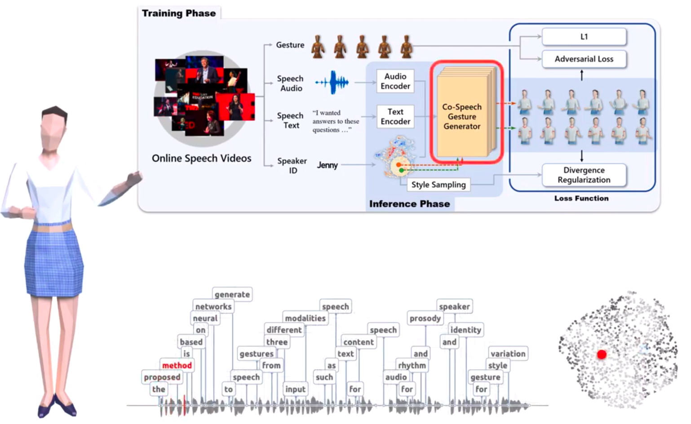

# Awesome Gesture Generation 

**Continuing editing (Not finished yet)**

A curated list of Awesome **Gesture Generation**

## Table of Contents

- [1. Survey](#survey)
- [2. Papers](#papers)
  - [Fundamental Paper](#fundamental)
  - [GENEA Challenge](#genea)
  - [Kaggle](#kaggle)
  - [2023](#2023)
  - [2022](#2022)
  - [2021](#2021)
  - [2020](#2020)
  - [2019](#2019)
  - [2018](#2018)
  - [Before 2017](#2017)
  - [Others](#others)
- [3. Approach](#approachs)
  - [3.1 Rule base approach](#rulebase)
  - [3.2 Data-driven approach](#datadriven)
    - [3.2.1 Statistical](#statistical)
    - [3.2.2 Deep learning approach](#deeplearning)
- [4. Pipeline](#pipeline)
- [5. Learning objective](#learnobjective)
- [6. Metric Evaluation](#metric)
- [7. Dataset](#dataset)
- [8. Toolkit](#toolkit)
- [9. Talks](#talks)
- [10. Code](#implementations)
- [Contributing](#contributing)

---

**Main resource**

- [paperswithcode.com/Gesture Generation](https://paperswithcode.com/task/gesture-generation)
- [GENEA Workshop](https://genea-workshop.github.io/)
- [github/topic/gesture-generation](https://github.com/topics/gesture-generation)
- [twitter/WorkshopGENEA](https://twitter.com/workshopgenea)
- [Scholar/gesture generation](https://scholar.google.com/scholar?hl=en&as_sdt=0%2C5&q=Gesture+Generation)

---

<!-- ###################################################### SURVEYS  ###################################################### -->

## <a name="survey">1. Survey</a>

#### **Comprehensive preview**

- 【EUROGRAPHICS 2023】[A Comprehensive Review of Data-Driven Co-Speech Gesture Generation](https://arxiv.org/abs/2301.05339) ; [github](https://github.com/google/mipnerf) ; [web](https://www.ea.com/seed/news/genea-challenge-2022)

- 2014 - [Gesture and speech in interaction: An overview](https://www.sciencedirect.com/science/article/abs/pii/S0167639313001295?via%3Dihub)

#### **Survey review**

- [Speech-based Gesture Generation for Robots and Embodied Agents: A Scoping Review](https://wafa.johal.org/files/papers/Speech_Driven_Gesture_Generation__A_Review.pdf)

#### **GENEA Challenge**

- [The GENEA Challenge 2022: A large evaluation of data-driven co-speech gesture generation](https://arxiv.org/abs/2208.10441) ; [homepage](https://youngwoo-yoon.github.io/GENEAchallenge2022/) ; [video](https://www.youtube.com/watch?v=4n02wXGGnd0)
- [GENEA Workshop 2021: The 2nd Workshop on Generation and Evaluation of Non-verbal Behaviour for Embodied Agents](https://dl.acm.org/doi/10.1145/3462244.3480983) ; [homepage](https://genea-workshop.github.io/2021/)
- [The GENEA Challenge 2020: A large, crowdsourced evaluation of gesture generation systems on common data](https://arxiv.org/abs/2102.11617) ; [homepage](https://svito-zar.github.io/GENEAchallenge2020/) ; [video](https://www.youtube.com/watch?v=QmaoKRzoVwM) ; [github](https://github.com/Svito-zar/genea_numerical_evaluations)

<!-- ###################################################### SURVEYS  ###################################################### -->

---

<!-- ###################################################### PAPERS  ###################################################### -->

## <a name="papers">2. Papers</a>

<!-- ************************* Base-paper ************************* -->

**<a name="fundamental">2.1 Fundamental Paper</a>**

- [The Relation of Speech and Gestures: Temporal Synchrony Follows Semantic Synchrony](https://core.ac.uk/download/pdf/15945024.pdf)
- [Complexity Matters E05: Complexity Matching and Synchronization between Gestures and Speech](https://www.youtube.com/watch?v=lMb-So8wKS8)
- ⭐ [Easier Said Than Done? Task Difficulty's Influence on Temporal Alignment, Semantic Similarity, and Complexity Matching Between Gestures and Speech](https://onlinelibrary.wiley.com/doi/full/10.1111/cogs.12989) ⭐

<!-- ************************* GENEA Challenge ************************* -->

**<a name="genea">2.2 GENEA Challenge</a>**

<!-- ************************* -->

  
<bold>2023 - Accepted papers</bold>

  <li></li>

<!-- ************************* -->

 

<!-- ************************* -->

<bold>GENEA Challenge 2022 - Accepted papers</bold>

<li>DeepMotion - <a href="https://dl.acm.org/doi/abs/10.1145/3536221.3558059">The DeepMotion entry to the GENEA Challenge 2022</a></li>
<li>DSI - <a href="https://openreview.net/forum?id=-2HZD-e6pX7W">Hybrid Seq2Seq Architecture for 3D Co-Speech Gesture Generation</a> ; <a href="">github</a></li>
<li>FineMotion - <a href="https://openreview.net/forum?id=uX86IlhiHNx">ReCell: replicating recurrent cell for auto-regressive pose generation</a></li>
<li>GestureMaster - <a href="https://dl.acm.org/doi/10.1145/3536221.3558063">GestureMaster: Graph-based Speech-driven Gesture Generation</a></li>
<li>IVI Lab - <a href="https://dl.acm.org/doi/abs/10.1145/3536221.3558060">The IVI Lab entry to the GENEA Challenge 2022 – A Tacotron2 Based Method for Co-Speech Gesture Generation With Locality-Constraint Attention Mechanism</a></li>
<li>ReprGesture - <a href="https://openreview.net/forum?id=atWaELmguNj7">The ReprGesture entry to the GENEA Challenge 2022</a></li>
<li>Ubisoft - <a href="https://openreview.net/forum?id=fO_Q4q1dFAA">Ubisoft Exemplar-based Stylized Gesture Generation from Speech: An Entry to the GENEA Challenge 2022</a></li>
<li>UEA Digital Humans - <a href="https://openreview.net/forum?id=RZP6nErM2Xa">UEA Digital Humans entry to the GENEA Challenge 2022</a></li>
<li>TransGesture - <a href="https://openreview.net/forum?id=AYMDEx97qPN">TransGesture: Autoregressive Gesture Generation with RNN-Transducer</a></li>
<li><a href="https://arxiv.org/abs/2210.06974">Evaluating Data-Driven Co-Speech Gestures of Embodied Conversational Agents through Real-Time Interaction</a> ; <a href="https://www.ea.com/seed/news/evaluating-data-driven-co-speech-gestures">web</a></li>

| Team               | Method         | Github                                                                                                      | Video                                               | Award |
| ------------------ | -------------- | ----------------------------------------------------------------------------------------------------------- | --------------------------------------------------- | ----- |
| DeepMotion         | VQ-VAE         | No github                                                                                                   | [link](https://www.youtube.com/watch?v=3L9pyPv-I8M) |       |
| DSI                | Hybrid Seq2Seq | [youngwoo-yoon/Co-Speech_Gesture_Generation](https://github.com/youngwoo-yoon/Co-Speech_Gesture_Generation) | [link]()                                            |       |
| FineMotion         | ReCell         |                                                                                                         | [link]()                                            |       |
| Forgerons          | Forgerons      |                                                                                                         | [link]()                                            |       |
| GestureMaster      | Ubisoft        |                                                                                                         | [link]()                                            |       |
| IVI Lab            |                |                                                                                                         | [link]()                                            | 🏆    |
| Murple AI lab      |                |                                                                                                         | [link]()                                            |       |
| ReprGesture        |                |                                                                                                         | [link]()                                            |       |
| TransGesture       |                |                                                                                                         | [link]()                                            |       |
| UEA Digital Humans |                |                                                                                                         | [link]()                                            |       |

<!-- ************************* -->

 

<!--

Description | Autogressive |
----------- | ------------ |
Title       | ✓            |
-->

<!-- ************************* -->

  
<bold>GENEA Challenge 2021 - Accepted papers</bold>

  <li><a href="https://openreview.net/forum?id=ykvm7OLh7B">Probabilistic Human-like Gesture Synthesis from Speech using GRU-based WGAN</a></li>
  <li><a href="https://openreview.net/forum?id=GjjPtEVdSLB">Influence of Movement Energy and Affect Priming on the Perception of Virtual Characters Extroversion and Mood</a></li>
  <li><a href="https://openreview.net/forum?id=o8CpxaBurZQ">Crossmodal clustered contrastive learning: Grounding of spoken language to gesture</a></li>

[GENEA WORKSHOP 2021](https://genea-workshop.github.io/2021/)

| Method                                                                                                        | Github                                                                                                  | Video                                               | Award |
| ------------------------------------------------------------------------------------------------------------- | ------------------------------------------------------------------------------------------------------- | --------------------------------------------------- | ----- |
| Probabilistic Human-like Gesture Synthesis from Speech using GRU-based WGAN                                   | [wubowen416/gesture-generation-using-WGAN](https://github.com/wubowen416/gesture-generation-using-WGAN) | [link](https://www.youtube.com/watch?v=PMhjX6cdIPE) | 🏆    |
| Influence of Movement Energy and Affect Priming on the Perception of Virtual Characters Extroversion and Mood | No github                                                                                               | No video                                            |       |
| Crossmodal clustered contrastive learning: Grounding of spoken language to gesture                            | [dondongwon/CC_NCE_GENEA](https://github.com/dondongwon/CC_NCE_GENEA)                                   | [link](https://www.youtube.com/watch?v=L5dHXTpCkeI) |       |

<!-- ************************* -->

 

<!-- ************************* -->

  
<bold>GENEA Challenge 2020 - Accepted papers</bold>

  <li><a href="https://zenodo.org/record/4088600">The StyleGestures entry to the GENEA Challenge 2020</a></li>
  <li><a href="https://zenodo.org/record/4088609">The FineMotion entry to the GENEA Challenge 2020</a></li>
  <li><a href="https://zenodo.org/record/4088376">Double-DCCCAE: Estimation of Sequential Body Motion Using Wave-Form - AlltheSmooth</a></li>
  <li><a href="https://zenodo.org/record/4090879">CGVU: Semantics-guided 3D Body Gesture Synthesis</a></li>
  <li><a href="https://zenodo.org/record/4088625">Interpreting and Generating Gestures with Embodied Human Computer Interactions</a></li>
  <li><a href="https://zenodo.org/record/4088629">The Nectec Gesture Generation System entry to the GENEA Challenge 2020</a></li>

[GENEA WORKSHOP 2020](https://genea-workshop.github.io/2020/)

[GENEA 2020 Keynote by Stefan Kopp "Leaving adolescence?"](https://www.youtube.com/watch?v=csjio1FKP-E)

| Method                               | Github                                                                                | Video                                               |
| ------------------------------------ | ------------------------------------------------------------------------------------- | --------------------------------------------------- |
| StyleGestures                        | [simonalexanderson/StyleGestures](https://github.com/simonalexanderson/StyleGestures) | [link](https://www.youtube.com/watch?v=JZgBlJKGFGk) |
| FineMotion                           | [FineMotion/GENEA_2020](https://github.com/FineMotion/GENEA_2020)                     | [link](https://www.youtube.com/watch?v=q29d9Hfbifk) |
| Double-DCCCAE                        | No github                                                                             | [link](https://www.youtube.com/watch?v=ht5Fu47JKkI) |
| CGVU                                 | No github                                                                             | [link](https://www.youtube.com/watch?v=MBSX0OLHRRU) |
| Interpreting and Generating Gestures | No github                                                                             | [link](https://www.youtube.com/watch?v=5I0FvhlcoDI) |
| Nectec Gesture Generation System     | No github                                                                             | [link](https://www.youtube.com/watch?v=0m0wKkNmrgQ) |

<!-- ************************* -->
<!-- ************************* GENEA Challenge ************************* -->

---

<!-- ************************* Kaggle ************************* -->

**<bold>2.3 Kaggle Ranking</bold>**

- **TEDTalk** (Extract skeleton from video Dataset)

  - [Learning Hierarchical Cross-Modal Association for Co-Speech Gesture Generation](https://arxiv.org/pdf/2203.13161.pdf) [github](https://github.com/alvinliu0/HA2G) ; [video]() ; [homepage](https://alvinliu0.github.io/projects/HA2G)
  - [Rhythmic Gesticulator: Rhythm-Aware Co-Speech Gesture Synthesis with Hierarchical Neural Embeddings](https://arxiv.org/abs/2210.01448) ; [github](https://github.com/aubrey-ao/humanbehavioranimation) ; [video](https://www.youtube.com/watch?v=qy2MrNhsoIs)
  - [Speech2AffectiveGestures: Synthesizing Co-Speech Gestures with Generative Adversarial Affective Expression Learning](https://arxiv.org/abs/2108.00262v2) [github](https://github.com/UttaranB127/speech2affective_gestures) ; [homepage](https://gamma.umd.edu/researchdirections/affectivecomputing/affagents/s2ag/) ; [video](https://www.youtube.com/watch?v=D_w1FtIVvQ8)
  - [Speech Gesture Generation from the Trimodal Context of Text, Audio, and Speaker Identity](https://arxiv.org/abs/2009.02119v1) [github](https://github.com/ai4r/Gesture-Generation-from-Trimodal-Context) ; [github](https://github.com/PantoMatrix/BEAT)
  - [Speech2AffectiveGestures: Synthesizing Co-Speech Gestures with Generative Adversarial Affective Expression Learning](https://arxiv.org/abs/2108.00262v2) [github](https://github.com/UttaranB127/speech2affective_gestures)

- **BEAT** (Motion Capture Dataset)
  - [BEAT: A Large-Scale Semantic and Emotional Multi-Modal Dataset for Conversational Gestures Synthesis](https://arxiv.org/abs/2203.05297v5) ; [github](https://github.com/PantoMatrix/BEAT)
  - [Speech Gesture Generation from the Trimodal Context of Text, Audio, and Speaker Identity](https://arxiv.org/abs/2009.02119v1) ; [github](https://github.com/ai4r/Gesture-Generation-from-Trimodal-Context)
  - [Audio2Gestures: Generating Diverse Gestures from Speech Audio with Conditional Variational Autoencoders](https://arxiv.org/abs/2108.06720v1)
  - [Learning Individual Styles of Conversational Gesture](https://github.com/amirbar/speech2gesture)
  - [Robots Learning to Say `No': Prohibition and Rejective Mechanisms in Acquisition of Linguistic Negation](https://arxiv.org/abs/1810.11804v1)

<!-- ************************* Kaggle ************************* -->

---

<!-- ************************* 2023 ************************* -->

**<a name="2023">2023</a>**

- 【CVPR23】[Co-speech Gesture Synthesis by Reinforcement Learning with Contrastive Pre-trained Rewards](https://batmanzzmc.github.io/assets/pdf/CVPR23.pdf)
- 【PAKDD 2023】[RLMixer: A Reinforcement Learning Approach For Integrated Ranking With Contrastive User Preference Modeling](https://batmanzzmc.github.io/assets/pdf/PAKDD2023.pdf)
- 

<!-- ************************* 2023 ************************* -->

---

<!-- ************************* 2022 ************************* -->

**<a name="2022">2022</a>**

- 【EUROGRAPHICS 2023】 [A Comprehensive Review of Data-Driven Co-Speech Gesture Generation](https://arxiv.org/abs/2301.05339) ; [github](https://github.com/google/mipnerf) ; [web](https://www.ea.com/seed/news/genea-challenge-2022)
- [Evaluating Data-Driven Co-Speech Gestures of Embodied Conversational Agents through Real-Time Interaction](https://arxiv.org/abs/2210.06974)
- [ZeroEGGS: Zero-shot Example-based Gesture Generation from Speech](https://arxiv.org/abs/2209.07556) ; [github](https://github.com/ubisoft/ubisoft-laforge-ZeroEGGS) ; [video](https://www.youtube.com/watch?v=EJPdTtVrxHo)
- [Voice2Face: Audio-Driven Facial and Tongue Rig Animations](https://media.contentapi.ea.com/content/dam/ea/seed/presentations/seed-sca2022-voice2face-paper.pdf) ; [video](https://www.youtube.com/watch?v=R4CWYAQe4Zs) ; [web](https://www.ea.com/seed/news/sca22-voice2face-audio-driven-facial-animation)
- [Deep Gesture Generation for Social Robots Using Type-Specific Libraries](https://arxiv.org/abs/2210.06790) ; [video](https://www.youtube.com/watch?v=R4CWYAQe4Zs) ; [web](https://www.ea.com/seed/news/sca22-voice2face-audio-driven-facial-animation)
- [The DeepMotion entry to the GENEA Challenge 2022](https://dl.acm.org/doi/abs/10.1145/3536221.3558059)
- [Automatic text‐to‐gesture rule generation for embodied conversational agents](https://onlinelibrary.wiley.com/doi/abs/10.1002/cav.1944) [video](https://www.youtube.com/watch?v=GIxaI9yTmMc)
- [Gesture2Vec: Clustering Gestures using Representation Learning Methods for Co-speech Gesture Generation](https://sfumars.com/wp-content/papers/2022_iros_gesture2vec.pdf) [github](https://github.com/pjyazdian/Gesture2Vec) ; [video](https://www.youtube.com/watch?v=ac8jWk4fdCU) ; [video](https://www.youtube.com/watch?v=qFObMpOboCg)

<!-- ************************* 2022 ************************* -->

---

<!-- ************************* 2021 ************************* -->

**<a name="2021">2021</a>**

- [Evaluating Data-Driven Co-Speech Gestures of Embodied Conversational Agents](https://dl.acm.org/doi/abs/10.1145/3514197.3549697)
- [Multimodal analysis of the predictability of hand-gesture properties](https://arxiv.org/abs/2108.05762)
- [Deep Gesture Generation for Social Robots Using Type-Specific Libraries](https://arxiv.org/abs/2210.06790)
- [A Framework for Integrating Gesture Generation Models into Interactive Conversational Agents](https://arxiv.org/abs/2102.12302) ; [video](https://www.youtube.com/watch?v=jhgUBS0125A) ; [homepage](https://nagyrajmund.github.io/project/gesturebot/) ; [github](https://github.com/nagyrajmund/gesturebot)
- [Speech2Properties2Gestures: Gesture-Property Prediction as a Tool for Generating Representational Gestures from Speech](https://arxiv.org/abs/2106.14736) ; [homepage](https://svito-zar.github.io/speech2properties2gestures/)
- [Moving Fast and Slow: Analysis of Representations and Post-Processing in Speech-Driven Automatic Gesture Generation](https://www.tandfonline.com/doi/full/10.1080/10447318.2021.1883883)
- 
- 

<!-- ************************* 2021 ************************* -->

---

<!-- ************************* 2020 ************************* -->

**<a name="2020">2020</a>**

- [The GENEA Challenge 2020: A large, crowdsourced evaluation of gesture generation systems on common data](https://arxiv.org/abs/2102.11617) ; [homepage](https://svito-zar.github.io/GENEAchallenge2020/) ; [video](https://www.youtube.com/watch?v=QmaoKRzoVwM) ; [video](https://www.youtube.com/watch?v=Y-5dgBQk34c) ; [github](https://github.com/Svito-zar/genea_numerical_evaluations)
- [Gesticulator: A framework for semantically-aware speech-driven gesture generation](https://arxiv.org/abs/2001.09326) ; [video](https://www.youtube.com/watch?v=VQ8he6jjW08) ; [github](https://github.com/Svito-zar/gesticulator) ; [homepage](https://svito-zar.github.io/gesticulator/) ; [dataset](https://figshare.com/projects/Gesticulator/87128)
- 【EUROGRAPHICS 2020】[Style-Controllable Speech-Driven Gesture Synthesis Using Normalising Flows]() ; [video](https://www.youtube.com/watch?v=egf3tjbWBQE) ; [github](https://github.com/simonalexanderson/StyleGestures)
- [Probabilistic Multi-modal Interlocutor-awa\*re Generation of Facial Gestures in Dyadic Settings](https://arxiv.org/abs/2006.09888) ; [video](https://www.youtube.com/watch?v=RhazMS4L_bk) ; [homepage](https://jonepatr.github.io/lets_face_it/)
- [Can we trust online crowdworkers? Comparing online and offline participants in a preference test of virtual agents](https://arxiv.org/pdf/2009.10760.pdf)
- 
- 

<!-- ************************* 2020 ************************* -->

---

<!-- ************************* 2019 *********](#**************** -->

**<a name="2019">2019</a>**

- [Analyzing Input and Output Representations for Speech-Driven Gesture Generation](https://arxiv.org/abs/1903.03369) ; [github](https://github.com/GestureGeneration/Speech_driven_gesture_generation_with_autoencoder) ; [video](https://www.youtube.com/watch?v=Iv7UBe92zrw) ; [video](https://www.youtube.com/watch?v=tQLVyTVtsSU) ; [homepage](https://svito-zar.github.io/audio2gestures/)
- [On the Importance of Representations for Speech-Driven Gesture Generation](https://www.ifaamas.org/Proceedings/aamas2019/pdfs/p2072.pdf)
- 
- 

<!-- ************************* 2019 ************************* -->

---

<!-- ************************* 2018 ************************* -->

**<a name="2018">2018</a>**

- [A Neural Network Approach to Missing Marker Reconstruction in Human Motion Capture](https://arxiv.org/abs/1803.02665) ; [video](https://www.youtube.com/watch?v=mi75gzEhbHI) ; [video](https://www.youtube.com/watch?v=MFdFqxCNhN0) ; [github](https://github.com/Svito-zar/NN-for-Missing-Marker-Reconstruction)
- [Data Driven Non-Verbal Behavior Generation for Humanoid Robots](https://dl.acm.org/doi/10.1145/3242969.3264970)
- [A Neural Network Approach to Missing Marker Reconstruction in Human Motion Capture](https://www.researchgate.net/publication/323626902_A_Neural_Network_Approach_to_Missing_Marker_Reconstruction_in_Human_Motion_Capture) ; [github](https://github.com/Svito-zar/NN-for-Missing-Marker-Reconstruction) ; [video](https://www.youtube.com/watch?v=mi75gzEhbHI)
- 

<!-- ************************* 2018 ************************* -->

---

<!-- ************************* <2017 ************************* -->

**<a name="2017">Before 2017</a>**

-

<!-- ************************* <2017 ************************* -->

---

<!-- ************************* Others ************************* -->

**<a name="others">Others</a>**

- [Rig Inversion by Training a Differentiable Rig Function](https://arxiv.org/abs/2301.09567) ; [video](https://www.youtube.com/watch?v=sYCz9LGIkuI)

<!-- ************************* Others ************************* -->

<!-- ###################################################### PAPERS  ###################################################### -->

---

<!-- ###################################################### APPROACHS  ###################################################### -->

## <a name="approachs">3. Approachs</a>

<!-- ************************* Rule Base ************************* -->

### <a name="rulebase"> 3.1 Rule Base approach

-

<!-- ************************* Rule Base ************************* -->

---

<!-- ************************* Deep learning ************************* -->

### <a name="datadriven">3.2 Data-driven approach

-

#### <a name="statistical">3.2.1 Statistical

-

#### <a name="deeplearning">3.2.2 Deep learning approach

- Rhythmic Gesticulator - [Rhythmic Gesticulator: Rhythm-Aware Co-Speech Gesture Synthesis with Hierarchical Neural Embeddings](https://arxiv.org/abs/2210.01448) ; [github](https://github.com/aubrey-ao/humanbehavioranimation) ; [video](https://www.youtube.com/watch?v=qy2MrNhsoIs) ; [video](https://www.youtube.com/watch?v=DO_W8plFWco)
- HA2G - [Learning Hierarchical Cross-Modal Association for Co-Speech Gesture Generation](https://arxiv.org/abs/2203.13161) ; [github](https://github.com/alvinliu0/HA2G)
- DiffGAN - [Low-Resource Adaptation for Personalized Co-Speech Gesture Generation](https://openaccess.thecvf.com/content/CVPR2022/papers/Ahuja_Low-Resource_Adaptation_for_Personalized_Co-Speech_Gesture_Generation_CVPR_2022_paper.pdf)
- [Towards Context-Aware Human-like Pointing Gestures with RL Motion Imitation](https://www.diva-portal.org/smash/record.jsf?pid=diva2:1664509)
- [Audio-Driven Neural Gesture Reenactment With Video Motion Graphs](https://openaccess.thecvf.com/content/CVPR2022/html/Zhou_Audio-Driven_Neural_Gesture_Reenactment_With_Video_Motion_Graphs_CVPR_2022_paper.html)
- [Text/Speech-Driven Full-Body Animation](https://arxiv.org/abs/2205.15573)
- SEEG - [SEEG: Semantic Energized Co-Speech Gesture Generation](https://openaccess.thecvf.com/content/CVPR2022/html/Liang_SEEG_Semantic_Energized_Co-Speech_Gesture_Generation_CVPR_2022_paper.html) ; [github](https://github.com/akira-l/seeg)
- [A Motion Matching-based Framework for Controllable Gesture Synthesis from Speech](https://dl.acm.org/doi/abs/10.1145/3528233.3530750)
- [Zero-Shot Style Transfer for Gesture Animation driven by Text and Speech using Adversarial Disentanglement of Multimodal Style Encoding](https://arxiv.org/abs/2208.01917)
- ZeroEGGS [Exemplar-based stylized gesture generation from speech: An entry to the GENEA Challenge 2022](https://dl.acm.org/doi/abs/10.1145/3536221.3558068)
- GestureMaster [GestureMaster: Graph-based Speech-driven Gesture Generation](https://dl.acm.org/doi/abs/10.1145/3536221.3558063)
- [Context-Aware Body Gesture Generation for Social Robots](https://kclpure.kcl.ac.uk/portal/en/publications/contextaware-body-gesture-generation-for-social-robots(fe4a7b59-027b-4bd8-a751-29cee9777c92).html)
- [Multimodal analysis of the predictability of hand-gesture properties](https://arxiv.org/abs/2108.05762)
- [Modeling the Conditional Distribution of Co-Speech Upper Body Gesture Jointly Using Conditional-GAN and Unrolled-GAN](https://www.mdpi.com/2079-9292/10/3/228)
- [Probabilistic Human-like Gesture Synthesis from Speech using GRU-based WGAN](https://dl.acm.org/doi/abs/10.1145/3461615.3485407)
- Flow-VAE [Speech-Driven Conversational Agents using Conditional Flow-VAEs](https://dl.acm.org/doi/10.1145/3485441.3485647)
- [Passing a Non-verbal Turing Test: Evaluating Gesture Animations Generated from Speech](https://arxiv.org/abs/2107.00712)
- [Speech Drives Templates: Co-Speech Gesture Synthesis With Learned Templates](https://openaccess.thecvf.com/content/ICCV2021/html/Qian_Speech_Drives_Templates_Co-Speech_Gesture_Synthesis_With_Learned_Templates_ICCV_2021_paper.html)
- CMCF [CCFM: An Architecture for Realtime Gesture Generation by Clustering Gestures by Communicative Function and Motion](https://eprints.gla.ac.uk/253967/1/253967.pdf)
- ExpressGesture [ExpressGesture: Expressive gesture generation from speech through database matching](https://onlinelibrary.wiley.com/doi/full/10.1002/cav.2016)
- Text2Gestures [Text2Gestures: A Transformer-Based Network for Generating Emotive Body Gestures for Virtual Agents](https://arxiv.org/abs/2101.11101)
- [Crossmodal Clustered Contrastive Learning: Grounding of Spoken Language to Gesture](https://dl.acm.org/doi/abs/10.1145/3461615.3485408)
- Body2Hands [Body2Hands: Learning To Infer 3D Hands From Conversational Gesture Body Dynamics](https://openaccess.thecvf.com/content/CVPR2021/html/Ng_Body2Hands_Learning_To_Infer_3D_Hands_From_Conversational_Gesture_Body_CVPR_2021_paper.html)
- Audio2Gestures [Audio2Gestures: Generating Diverse Gestures From Speech Audio With Conditional Variational Autoencoders](https://openaccess.thecvf.com/content/ICCV2021/html/Li_Audio2Gestures_Generating_Diverse_Gestures_From_Speech_Audio_With_Conditional_Variational_ICCV_2021_paper.html)
- [Audio and Text-Driven approach for Conversational Gestures Generation](https://www.dialog-21.ru/media/5526/korzunvaplusdimovinpluszharkovaa031.pdf)
- [Learning Speech-driven 3D Conversational Gestures from Video](https://dl.acm.org/doi/abs/10.1145/3472306.3478335)
- AiSLE [No Gestures Left Behind: Learning Relationships between Spoken Language and Freeform Gestures](https://aclanthology.org/people/l/louis-philippe-morency/)
- StyleGestures [Style-Controllable Speech-Driven Gesture Synthesis Using Normalising Flows](https://onlinelibrary.wiley.com/doi/abs/10.1111/cgf.13946)
- Gesticulator [Gesticulator: A framework for semantically-aware speech-driven gesture generation](https://arxiv.org/abs/2001.09326)
- [Affective synthesis and animation of arm gestures from speech prosody](https://www.sciencedirect.com/science/article/abs/pii/S0167639319301980)
- [Speech gesture generation from the trimodal context of text, audio, and speaker identity](https://dl.acm.org/doi/abs/10.1145/3414685.3417838)
- Mix-StAGE [Style Transfer for Co-Speech Gesture Animation: A Multi-Speaker Conditional-Mixture Approach](https://arxiv.org/abs/2007.12553)
- CDBN [Speech-driven animation with meaningful behaviors](https://www.sciencedirect.com/science/article/abs/pii/S0167639318300013)
- [Multi-objective adversarial gesture generation](https://dl.acm.org/doi/abs/10.1145/3359566.3360053)
- Speech2Gesture [Learning Individual Styles of Conversational Gesture](https://openaccess.thecvf.com/content_CVPR_2019/html/Ginosar_Learning_Individual_Styles_of_Conversational_Gesture_CVPR_2019_paper.html)
- DRAM [To React or not to React: End-to-End Visual Pose Forecasting for Personalized Avatar during Dyadic Conversations](https://dl.acm.org/doi/abs/10.1145/3340555.3353725)
- [Robots Learn Social Skills: End-to-End Learning of Co-Speech Gesture Generation for Humanoid Robots](https://arxiv.org/abs/1810.12541)
- [Analyzing Input and Output Representations for Speech-Driven Gesture Generation](https://arxiv.org/abs/1903.03369)
- [A Speech-Driven Hand Gesture Generation Method and Evaluation in Android Robots](https://ieeexplore.ieee.org/abstract/document/8411101) ; [video](https://www.youtube.com/watch?v=nr867hoQB-M)
- [Evaluation of Speech-to-Gesture Generation Using Bi-Directional LSTM Network](https://dl.acm.org/doi/abs/10.1145/3267851.3267878)
- DCNF [Predicting Co-verbal Gestures - A Deep and Temporal Modeling Approach](https://link.springer.com/chapter/10.1007/978-3-319-21996-7_17)

---

<!-- ************************* Deep learning ************************* -->

<!-- ###################################################### APPROACHS  ###################################################### -->

<!-- ###################################################### PIPELINES  ###################################################### -->

## <a name="pipeline">4. Pipelines

-

<!-- ###################################################### PIPELINES  ###################################################### -->

---

<!-- ###################################################### LEARNING OBJECTED  ###################################################### -->

## <a name="learnobjective"> 5. Learning Objective

| Full name                                                     | Description                                                                                                                                                                                                                                                                 |
| ------------------------------------------------------------- | --------------------------------------------------------------------------------------------------------------------------------------------------------------------------------------------------------------------------------------------------------------------------- |
| Adversarial Loss (**Adv**)                                    | Used in Generative Adversarial Networks (GANs), this loss function pits a generator network against a discriminator network, with the goal of the generator producing samples that can fool the discriminator into thinking they are real.                                  |
| Categorical Cross Entropy (**CCE**)                           | A common loss function used in multi-class classification tasks, where the goal is to minimize the difference between the predicted and true class labels.                                                                                                                  |
| Cross-modal Cluster Noise Contrastive Estimation (**CC-NCE**) | Used in multimodal learning to learn joint representations across different modalities, this loss function maximizes the similarity between matching modalities while minimizing the similarity between non-matching modalities.                                            |
| Edge Transition Cost (**ETC**)                                | Used in graph-based image segmentation, this loss function measures the similarity between adjacent pixels in an image to preserve the coherence and smoothness of segmented regions.                                                                                       |
| Expectation Maximization (**EM**)                             | Used for maximum likelihood estimation when dealing with incomplete or missing data, this algorithm involves computing the expected likelihood of the missing data and updating model parameters to maximize the likelihood of the observed data given the expected values. |
| Geodesic Distance (**GeoD**)                                  | Used in deep learning for image segmentation, this loss function penalizes the discrepancy between the predicted segmentation map and the ground truth, while also considering the spatial relationships between different image regions.                                   |
| Wasserstein-GAN Gradient Penalty (**WGAN-GP**)                | An extension of the Wasserstein GAN algorithm that adds a gradient penalty term to the loss function, used to enforce the Lipschitz continuity constraint and ensure stability during training.                                                                             |
| Hamming Distance (**Hamm**)                                   | Used in information theory, this metric measures the number of positions at which two strings differ.                                                                                                                                                                       |
| Huber Loss (**Huber**)                                        | A robust loss function used in regression tasks that is less sensitive to outliers than the Mean Squared Error (MSE) loss.                                                                                                                                                  |
| Imitation Reward (**IR**)                                     | Used in imitation learning to train a model to mimic the behavior of an expert agent, by providing a reward signal based on how closely the model's behavior matches that of the expert.                                                                                    |
| Kullback–Leibler Divergence (**KL**)                          | Used to measure the difference between two probability distributions, this loss function is commonly used in probabilistic models and deep learning for regularization and training.                                                                                        |
| L2 Distance (**L2**)                                          | Measures the Euclidean distance between two points in space, commonly used in regression tasks.                                                                                                                                                                             |
| Mean Absolute Error (**MAE**)                                 | A loss function used in regression tasks that measures the average difference between the predicted and true values.                                                                                                                                                        |
| Maximum Likelihood Estimation (**MLE**)                       | A statistical method used to estimate the parameters of a probability distribution that maximize the likelihood of observing the data.                                                                                                                                      |
| Mean Squared Error (**MSE**)                                  | A common loss function used in regression tasks that measures the average squared difference between the predicted and true values.                                                                                                                                         |
| Negative Log-likelihood (**NLL**)                             | Used in probabilistic models to maximize the likelihood of the observed data by minimizing the negative log-likelihood.                                                                                                                                                     |
| Structural Similarity Index Measure (**SIMM**)                | Used in image processing to measure the similarity between two images based on their luminance, contrast, and structural content.                                                                                                                                           |
| Task Reward (**TR**)                                          | Used in reinforcement learning to provide a reward signal to an agent based on its performance in completing a given task.                                                                                                                                                  |
| Variance (**Var**)                                            | A statistical metric used to measure the variability of a set of data points around their mean.                                                                                                                                                                             |
| Within-cluster Sum of Squares (**WCSS**)                      | Used in cluster analysis to measure the variability of data points within a cluster by computing the sum of squared distances between each data point and the mean of the cluster.                                                                                          |

<!-- ###################################################### LEARNING OBJECTED  ###################################################### -->

---

<!-- ###################################################### METRIC  ###################################################### -->

## <a name="metric"> 5. Metric Evaluation

- 🧑‍🦲 : Upper-body tier
- 🧍 : Full-body tier

| Metric | Type | Description               |
| ------ | ---- | ------------------------- |
| FNA    | 🧍   | Full-body Natural Motion  |
| FBT    | 🧍   | Full-body Text-based      |
| FSA    | 🧍   | Full-body Audio-based     |
| UNA    | 🧑‍🦲   | Upper-body Natural Motion |
| UBA    | 🧑‍🦲   | Upper-body Audio-based    |
| UBT    | 🧑‍🦲   | Upper-body Text-based     |
| FSB    | 🧍   |                           |
| FSC    | 🧍   |                           |
| FSD    | 🧍   |                           |
| FSF    | 🧍   |                           |
| FSG    | 🧍   |                           |
| FSH    | 🧍   |                           |
| FSI    | 🧍   |                           |
| USJ    | 🧑‍🦲   |                           |
| USK    | 🧑‍🦲   |                           |
| USL    | 🧑‍🦲   |                           |
| USM    | 🧑‍🦲   |                           |
| USN    | 🧑‍🦲   |                           |
| USO    | 🧑‍🦲   |                           |
| USP    | 🧑‍🦲   |                           |
| USQ    | 🧑‍🦲   |                           |

<!-- ###################################################### METRIC  ###################################################### -->

---

<!-- ###################################################### DATASETS  ###################################################### -->

## <a name="dataset">4. Datasets</a>

- **Modalities type**:

  - 🔊 : audio
  - 📃 : text
  - 🤯 : emotion
  - 🚶 : gesture motion
  - ℹ️ : gesture properties
  - 🎞️ : gesture segment

- **Type**

  - 👥 : Dialog (Conversation between two people 🤼)
  - 👤 : Monolog (Self conversation 🧍)

| Dataset                                                                                                                                                               | Modalities         | Type   | Link                                                                                                                                     | Paper                                                                                                    |
| --------------------------------------------------------------------------------------------------------------------------------------------------------------------- | ------------------ | ------ | ---------------------------------------------------------------------------------------------------------------------------------------- | -------------------------------------------------------------------------------------------------------- |
| IEMOCAP                                                                                                                                                               | 🚶, 🔊, 📃, 🤯     | 👥     | [sail.usc.edu/iemocap](https://sail.usc.edu/iemocap)                                                                                     | [arxiv](https://arxiv.org/pdf/1810.12541.pdf)                                                            |
| Creative-IT                                                                                                                                                           | 🚶, 🔊, 📃, 🤯     | 👥     | [sail.usc.edu/CreativeIT](https://sail.usc.edu/CreativeIT/ImprovRelease.htm)                                                             |                                                                                                          |
| Gesture-Speech Dataset                                                                                                                                                | 🚶, 🔊             | 👤     | [dropbox](https://www.dropbox.com/sh/j419kp4m8hkt9nd/AAC_pIcS1b_WFBqUp5ofBG1Ia?dl=0)                                                     |                                                                                                          |
| CMU Panoptic                                                                                                                                                          | 🚶, 🔊, 📃         | 👥     | [domedb.perception.cmu](http://domedb.perception.cs.cmu.edu)                                                                             | [arxiv](https://arxiv.org/abs/1612.03153)                                                                |
| Speech-Gesture                                                                                                                                                        | 🚶, 🔊             | 👤     | [amirbar/speech2gesture](https://github.com/amirbar/speech2gesture)                                                                      | [arxiv](https://arxiv.org/abs/1906.04160)                                                                |
| TED Dataset [homepage](https://sites.google.com/view/youngwoo-yoon/projects/co-speech-gesture-generation)                                                             | 🚶, 🔊             | 👤     | [youtube-gesture-dataset](https://github.com/youngwoo-yoon/youtube-gesture-dataset)                                                      |                                                                                                          |
| Talking With Hands ([github](https://github.com/facebookresearch/TalkingWithHands32M))                                                                                | 🚶, 🔊             | 👥     | [facebookresearch/TalkingWithHands32M](https://github.com/facebookresearch/TalkingWithHands32M)                                          | [personalrobotics](https://personalrobotics.cs.washington.edu/publications/lee2019handmotiondataset.pdf) |
| PATS ([homepage](https://chahuja.com/pats/), [github](https://github.com/chahuja/pats))                                                                               | 🚶, 🔊, 📃         | 👤     | [chahuja.com/pats](https://chahuja.com/pats)                                                                                             | [arxiv](https://arxiv.org/pdf/2007.12553v1.pdf)                                                          |
| Trinity Speech-Gesture I                                                                                                                                              | 🚶, 🔊, 📃         | 👤     | [Trinity Speech-Gesture I](https://trinityspeechgesture.scss.tcd.ie/data/Trinity%20Speech-Gesture%20I/GENEA_Challenge_2020_data_release) |                                                                                                          |
| Trinity Speech-Gesture II                                                                                                                                             | 🚶, 🔊, 🎞️         | 👤     | [Trinity Speech GestureII](https://trinityspeechgesture.scss.tcd.ie/data/Trinity%20Speech-Gesture%20II)                                  |                                                                                                          |
| Speech-Gesture 3D extension                                                                                                                                           | 🚶, 🔊             | 👤     | [nextcloud.mpi-klsb](https://nextcloud.mpi-klsb.mpg.de/index.php/s/7LzxGSepzrndg2x)                                                      |                                                                                                          |
| Talking With Hands GENEA Extension                                                                                                                                    | 🚶, 🔊, 📃         | 👥     | [zenodo/6998231](https://zenodo.org/record/6998231)                                                                                      | [dl.acm.org](https://dl.acm.org/doi/abs/10.1145/3536221.3558068)                                         |
| SaGA                                                                                                                                                                  | 🚶, 🔊, ℹ️         | 👥     | [phonetik.uni-muenchen](https://www.phonetik.uni-muenchen.de/Bas/BasSaGAeng.html)                                                        | [uni-bielefeld](https://pub.uni-bielefeld.de/record/2001935)                                             |
| SaGA++                                                                                                                                                                | 🚶, 🔊, ℹ️         | 👥     | [zenodo/6546229](https://zenodo.org/record/6546229)                                                                                      |                                                                                                          |
| ZEGGS Dataset [video](https://www.youtube.com/watch?v=YFg7QKWkjwQ)                                                                                                    | 🚶, 🔊             | 👤     | [ubisoft-laforge-ZeroEGGS](https://github.com/ubisoft/ubisoft-laforge-ZeroEGGS)                                                          | [arxiv](https://arxiv.org/abs/2209.07556)                                                                |
| BEAT Dataset ([homepage](https://pantomatrix.github.io/BEAT-Dataset/) [homepage](https://pantomatrix.github.io/BEAT/), [github](https://github.com/PantoMatrix/BEAT)) | 🚶, 🔊, 📃, ℹ️, 🤯 | 👥, 👤 | [github.io/BEAT](https://pantomatrix.github.io/BEAT)                                                                                     | [arxiv](https://arxiv.org/pdf/2203.05297.pdf)                                                            |

#### 2022 GENEA Challenge:

- Challenge dataset: [GENEA Challenge 2022 Dataset Files](https://zenodo.org/record/6998231)
- 3D coordinates of submitted motion: [GENEA Challenge 2022 3D coordinates of submitted motion](https://zenodo.org/record/6973297)
- Submitted BVH files: [GENEA Challenge 2022 submitted BVH files](https://zenodo.org/record/6977157)
- User-study video stimuli: [GENEA Challenge 2022 user-study video stimuli](https://zenodo.org/record/6997926)

<!-- ###################################################### DATASETS  ###################################################### -->

---

<!-- ###################################################### TOOLKIT  ###################################################### -->

## <a name="toolkit">5. Toolkit</a>

- Algorithms

  - [SGToolkit: An Interactive Gesture Authoring Toolkit for Embodied Conversational Agents](https://github.com/ai4r/SGToolkit) ; [homepage](https://uist.acm.org/uist2021/) ; [video](https://www.youtube.com/watch?v=qClSOtLiVlc)

- Recognition:

  - OpenPose - [CMU-Perceptual-Computing-Lab/openpose](https://github.com/CMU-Perceptual-Computing-Lab/openpose)
  - MMPose - [open-mmlab/mmpose](https://github.com/open-mmlab/mmpose)
  - AlphaPose - [MVIG-SJTU/AlphaPose](https://github.com/MVIG-SJTU/AlphaPose)

- Audio pre-processing:

  -

- Mesh processing:

  - Utility to trim BVH files: [github.com/ghenter/trim_bvh](https://github.com/ghenter/trim_bvh)

- Visualization:
  - [github.com/TeoNikolov/genea_visualizer](https://github.com/TeoNikolov/genea_visualizer)

<!-- ###################################################### TOOLKIT  ###################################################### -->

<!-- ######################## TALKS  ########################### -->

## <a name="talks">Talks</a>

- [The GENEA Challenge 2022: A large evaluation of data-driven co-speech gesture generation](https://www.youtube.com/watch?v=SDw70iNH6cM&list=PLaTrbkxf82xaNqhwVlX9LwLaKTLX-5izq&index=1)

<!-- ######################## CODE  ########################### -->

## <a name="code">Code</a>

- Objective evaluation code: [github.com/genea-workshop/genea_numerical_evaluations](https://github.com/genea-workshop/genea_numerical_evaluations)
- Text-based baseline: [github.com/youngwoo-yoon/Co-Speech_Gesture_Generation](https://github.com/youngwoo-yoon/Co-Speech_Gesture_Generation)
- Audio-based baseline: [github.com/genea-workshop/Speech_driven_gesture_generation_with_autoencoder](https://github.com/genea-workshop/Speech_driven_gesture_generation_with_autoencoder/tree/GENEA_2022)
- Interface for subjective evaluations: [jonepatr/hemvip](https://github.com/jonepatr/hemvip/tree/genea2022)
- Code for creating attention-check videos: [youngwoo-yoon/create_attention_check](https://github.com/youngwoo-yoon/create_attention_check)
- Utility to trim BVH files: [github.com/ghenter/trim_bvh](https://github.com/ghenter/trim_bvh)
- Modified PyMO for the challenge dataset: [youngwoo-yoon/PyMO](https://github.com/youngwoo-yoon/PyMO)

<!-- $l_{G e n}^{S R}=\sum_{n=1}^N-\log D_{\theta_D}\left(G_{\theta_G}\left(I^{L R}\right)\right)$                                                                                                                                                                                                              |
$Loss = -\sum_{i=1}^{\text{output size}} y_i \cdot \log \hat{y}_i$                                                                                                                                                                                                                                         |
$L = -log(\frac{s}{(s + n)})$                                                                                                                                                                                                                                                                              |
$L*{E T C}=\sum_c \sum*{i, j} w\_{i j}\left(y_i \neq y_j\right) \exp \left(-\lambda\left \| I_i-I_j\right \| ^2\right)$                                                                                                                                                                                    |
$L_{EM}=−log_p ( X ∣ θ )$ $Q\left(\theta \mid \theta^{(t)}\right)=\mathbb{E}_{Z \mid X, \theta^{(t)}}[\log p(X, Z \mid \theta)]$                                                                                                                                                                           |
$L_{G D}=\frac{1}{N} \sum_{i=1}^N \sum_{j=1}^N D_{i j} \cdot \mathbb{I}_{i \neq j} \cdot \mathbb{I}_{y_i=y_j}$                                                                                                                     s                                                                        |
$L_{W G A N-G P}=-\mathbb{E}_{\mathbf{x} \sim p_{\text {data }}}[D(\mathbf{x})]+\mathbb{E}_{\mathbf{z} \sim p_{\mathbf{z}}}[D(G(\mathbf{z}))]+\lambda \mathbb{E}_{\hat{\mathbf{x}} \sim p_{\hat{\mathbf{x}}}}\left[\left(\left\|\nabla_{\hat{\mathbf{x}}} D(\hat{\mathbf{x}})\right\|_2-1\right)^2\right]$ | -->

<!-- ######################## CODE  ########################### -->

## Books

- 2000 - [Paired Speech and Gesture Generation in Embodied Conversational Agents](https://www.google.com/books/edition/Paired_Speech_and_Gesture_Generation_in/LgrmtgAACAAJ)
- 2009 - [Gesture in Embodied Communication and Human Computer Interaction](https://www.google.com/books/edition/Gesture_in_Embodied_Communication_and_Hu/vLqoCAAAQBAJ?hl=en&gbpv=0)
- 2013 - [Nonverbal Communication in Human Interaction](https://books.google.co.uk/books?id=-g7hkSR_mLoC)
- 2013 - [Nonverbal Communication: Science and Applications](https://books.google.co.uk/books?id=PeOeu3qFFTIC)

## License

MIT

## Created by [OpenHuman](https://github.com/Openhuman-ai)

[OpenHuman.ai](https://www.openhuman.ai) - Open Realistic Digital Human
