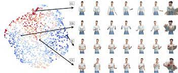

# Awesome Gesture Generation 

A curated list of Awesome **Gesture Generation**

## Table of Contents

- [1. Survey](#survey)
- [2. Method](#method)
- [3. Papers](#papers)
  - [Fundamental Paper](#fundamental)
  - [GENEA Challenge](#genea)
  - [2023](#2023)
  - [2022](#2022)
  - [2021](#2021)
  - [2020](#2020)
  - [2019](#2019)
  - [2018](#2018)
  - [2017](#2017)
  - [Others](#others)
- [4. Dataset](#dataset)
- [5. Toolkit](#toolkit)
- [6. Talks](#talks)
- [7. Code](#implementations)
- [Contributing](#contributing)

---

**PapersWithCode**

- Gesture Generation : [https://paperswithcode.com/task/gesture-generation](https://paperswithcode.com/task/gesture-generation)

## <a name="survey">1. Survey</a>

Comprehensive preview

**Machine Learning**

- [A Comprehensive Review of Data-Driven Co-Speech Gesture Generation](https://arxiv.org/abs/2301.05339) | [github](https://github.com/google/mipnerf) | [web](https://www.ea.com/seed/news/genea-challenge-2022)

- [Gesture and speech in interaction: An overview](https://www.sciencedirect.com/science/article/abs/pii/S0167639313001295?via%3Dihub)

GENEA Challenge

- [The GENEA Challenge 2022: A large evaluation of data-driven co-speech gesture generation](https://arxiv.org/abs/2208.10441) | [homepage](https://youngwoo-yoon.github.io/GENEAchallenge2022/) | [video](https://www.youtube.com/watch?v=4n02wXGGnd0)

- [GENEA Workshop 2021: The 2nd Workshop on Generation and Evaluation of Non-verbal Behaviour for Embodied Agents](https://dl.acm.org/doi/10.1145/3462244.3480983) | [homepage](https://genea-workshop.github.io/2021/)

- [The GENEA Challenge 2020: A large, crowdsourced evaluation of gesture generation systems on common data](https://arxiv.org/abs/2102.11617) | [homepage](https://svito-zar.github.io/GENEAchallenge2020/) | [video](https://www.youtube.com/watch?v=QmaoKRzoVwM) | [github](https://github.com/Svito-zar/genea_numerical_evaluations)

## <a name="method">2. Method</a>

-

## <a name="papers">3. Papers</a>

<!-- ************************* Base-paper ************************* -->

<a name="fundamental">Fundamental Paper</a>

- [The Relation of Speech and Gestures: Temporal Synchrony Follows Semantic Synchrony](https://core.ac.uk/download/pdf/15945024.pdf)
- [Complexity Matters E05: Complexity Matching and Synchronization between Gestures and Speech](https://www.youtube.com/watch?v=lMb-So8wKS8)

<!-- ************************* Base-paper ************************* -->

---

<!-- ************************* GENEA Challenge ************************* -->

<a name="genea">GENEA Challenge</a>

- **2023 - Accepted papers**

  - [Evaluating Data-Driven Co-Speech Gestures of Embodied Conversational Agents through Real-Time Interaction](https://arxiv.org/abs/2210.06974) | [web](https://www.ea.com/seed/news/evaluating-data-driven-co-speech-gestures)

- **2022 - Accepted papers**

| Method             | Description | Autogressive | RNN | A   | Es  | Other |
| ------------------ | ----------- | ------------ | --- | --- | --- | ----- |
| DeepMotion         | Title       | ✓            | ✓   | ✓   | ✓   | ✓     |
| DSI                | Text        | ✓            | ✓   | ✓   | ✓   | ✓     |
| FineMotion         | Text        | ✓            | ✓   | ✓   | ✓   | ✓     |
| Forgerons          | Text        | ✓            | ✓   | ✓   | ✓   | ✓     |
| GestureMaster      | Text        | ✓            | ✓   | ✓   | ✓   | ✓     |
| IVI Lab            | Text        | ✓            | ✓   | ✓   | ✓   | ✓     |
| Murple AI lab      | Text        | ✓            | ✓   | ✓   | ✓   | ✓     |
| ReprGesture        | Text        | ✓            | ✓   | ✓   | ✓   | ✓     |
| TransGesture       | Text        | ✓            | ✓   | ✓   | ✓   | ✓     |
| UEA Digital Humans | Text        | ✓            | ✓   | ✓   | ✓   | ✓     |

- DeepMotion - [The DeepMotion entry to the GENEA Challenge 2022](https://dl.acm.org/doi/abs/10.1145/3536221.3558059)
- IVI Lab - [The IVI Lab entry to the GENEA Challenge 2022 – A Tacotron2 Based Method for Co-Speech Gesture Generation With Locality-Constraint Attention Mechanism](https://dl.acm.org/doi/abs/10.1145/3536221.3558060)
- Ubisoft [Exemplar-based Stylized Gesture Generation from Speech: An Entry to the GENEA Challenge 2022](https://openreview.net/forum?id=fO_Q4q1dFAA) | [video](https://www.youtube.com/watch?v=zdNsj3MGpL0&list=PLaTrbkxf82xaNqhwVlX9LwLaKTLX-5izq&index=9)
- UEA Digital Humans - [UEA Digital Humans entry to the GENEA Challenge 2022](https://openreview.net/forum?id=RZP6nErM2Xa)
- GestureMaster - [GestureMaster: Graph-based Speech-driven Gesture Generation](https://dl.acm.org/doi/10.1145/3536221.3558063) | [video](https://www.youtube.com/watch?v=nwNwEGX33SA)
- FineMotion - [ReCell: replicating recurrent cell for auto-regressive pose generation](https://openreview.net/forum?id=uX86IlhiHNx)
- ReprGesture - [The ReprGesture entry to the GENEA Challenge 2022](https://openreview.net/forum?id=atWaELmguNj7)
- TransGesture - [TransGesture: Autoregressive Gesture Generation with RNN-Transducer](https://openreview.net/forum?id=AYMDEx97qPN)
- DSI - [Hybrid Seq2Seq Architecture for 3D Co-Speech Gesture Generation](https://openreview.net/forum?id=-2HZD-e6pX7W) | [github](https://github.com/youngwoo-yoon/Co-Speech_Gesture_Generation)

- **2021 - Accepted papers**

  - [Probabilistic Human-like Gesture Synthesis from Speech using GRU-based WGAN](https://openreview.net/forum?id=ykvm7OLh7B) | [video](https://www.youtube.com/watch?v=PMhjX6cdIPE)
  - [Influence of Movement Energy and Affect Priming on the Perception of Virtual Characters Extroversion and Mood](https://openreview.net/forum?id=GjjPtEVdSLB)
  - [Crossmodal clustered contrastive learning: Grounding of spoken language to gesture](https://openreview.net/forum?id=o8CpxaBurZQ) | [github](https://github.com/dondongwon/CC_NCE_GENEA)

- **2020 - Accepted papers**
  - [The StyleGestures entry to the GENEA Challenge 2020](https://genea-workshop.github.io/2020/downloads/Alexanderson2020StyleGestures.pdf) | [zendomo](https://zenodo.org/record/4088600#.ZBqRWNJByV4)
  - [The FineMotion entry to the GENEA Challenge 2020](https://zenodo.org/record/4088609#.ZBqSB9JByV4)
  - [Double-DCCCAE: Estimation of Sequential Body Motion Using Wave-Form - AlltheSmooth](https://zenodo.org/record/4088376#.ZBqR89JByV4)
  - [CGVU: Semantics-guided 3D Body Gesture Synthesis](https://zenodo.org/record/4090879#.ZBqSHtJByV4)
  - [Interpreting and Generating Gestures with Embodied Human Computer Interactions](https://zenodo.org/record/4088625#.ZBqSLtJByV4)
  - [The Nectec Gesture Generation System entry to the GENEA Challenge 2020](https://zenodo.org/record/4088629#.ZBqSQ9JByV4)s

<!-- ************************* GENEA Challenge ************************* -->

---

<!-- ************************* Kaggle ************************* -->

<a name="kaggle"><bold>Kaggle Ranking</bold></a>

- **TED Gesture Dataset**

  - [Learning Hierarchical Cross-Modal Association for Co-Speech Gesture Generation](https://arxiv.org/pdf/2203.13161.pdf) [github](https://github.com/alvinliu0/HA2G) | [video]() | [homepage](https://alvinliu0.github.io/projects/HA2G)
  - [Rhythmic Gesticulator: Rhythm-Aware Co-Speech Gesture Synthesis with Hierarchical Neural Embeddings](https://arxiv.org/abs/2210.01448) | [github](https://github.com/aubrey-ao/humanbehavioranimation) | [video](https://www.youtube.com/watch?v=qy2MrNhsoIs)
  - [Speech2AffectiveGestures: Synthesizing Co-Speech Gestures with Generative Adversarial Affective Expression Learning](https://arxiv.org/abs/2108.00262v2) [github](https://github.com/UttaranB127/speech2affective_gestures) | [homepage](https://gamma.umd.edu/researchdirections/affectivecomputing/affagents/s2ag/) | [video](https://www.youtube.com/watch?v=D_w1FtIVvQ8)
  - [Speech Gesture Generation from the Trimodal Context of Text, Audio, and Speaker Identity](https://arxiv.org/abs/2009.02119v1) [github](https://github.com/ai4r/Gesture-Generation-from-Trimodal-Context) | [github](https://github.com/PantoMatrix/BEAT)
  - [Speech2AffectiveGestures: Synthesizing Co-Speech Gestures with Generative Adversarial Affective Expression Learning](https://arxiv.org/abs/2108.00262v2) [github](https://github.com/UttaranB127/speech2affective_gestures)

- **BEAT**
  - [BEAT: A Large-Scale Semantic and Emotional Multi-Modal Dataset for Conversational Gestures Synthesis](https://arxiv.org/abs/2203.05297v5) | [github](https://github.com/PantoMatrix/BEAT)
  - [Speech Gesture Generation from the Trimodal Context of Text, Audio, and Speaker Identity](https://arxiv.org/abs/2009.02119v1) | [github](https://github.com/ai4r/Gesture-Generation-from-Trimodal-Context)
  - [Audio2Gestures: Generating Diverse Gestures from Speech Audio with Conditional Variational Autoencoders](https://arxiv.org/abs/2108.06720v1)
  - [Learning Individual Styles of Conversational Gesture](https://github.com/amirbar/speech2gesture)
  - [Robots Learning to Say `No': Prohibition and Rejective Mechanisms in Acquisition of Linguistic Negation](https://arxiv.org/abs/1810.11804v1)

<!-- ************************* Kaggle ************************* -->

---

<!-- ************************* 2023 ************************* -->

<a name="2023">2023</a>

- [A Comprehensive Review of Data-Driven Co-Speech Gesture Generation](https://arxiv.org/abs/2301.05339) | [github](https://github.com/google/mipnerf) | [web](https://www.ea.com/seed/news/genea-challenge-2022)
- 
- 
- 

<!-- ************************* 2023 ************************* -->

---

<!-- ************************* 2022 ************************* -->

<a name="2022">2022</a>

- [Evaluating Data-Driven Co-Speech Gestures of Embodied Conversational Agents through Real-Time Interaction](https://arxiv.org/abs/2104.10078)
- [ZeroEGGS: Zero-shot Example-based Gesture Generation from Speech](https://arxiv.org/abs/2209.07556) | [github](https://github.com/ubisoft/ubisoft-laforge-ZeroEGGS) | [video](https://www.youtube.com/watch?v=EJPdTtVrxHo)
- [Voice2Face: Audio-Driven Facial and Tongue Rig Animations](https://media.contentapi.ea.com/content/dam/ea/seed/presentations/seed-sca2022-voice2face-paper.pdf) | [video](https://www.youtube.com/watch?v=R4CWYAQe4Zs) | [web](https://www.ea.com/seed/news/sca22-voice2face-audio-driven-facial-animation)
- [Deep Gesture Generation for Social Robots Using Type-Specific Libraries](https://arxiv.org/abs/2210.06790) | [video](https://www.youtube.com/watch?v=R4CWYAQe4Zs) | [web](https://www.ea.com/seed/news/sca22-voice2face-audio-driven-facial-animation)
- [The DeepMotion entry to the GENEA Challenge 2022](https://dl.acm.org/doi/abs/10.1145/3536221.3558059)
- [Automatic text‐to‐gesture rule generation for embodied conversational agents](https://onlinelibrary.wiley.com/doi/abs/10.1002/cav.1944) [video](https://www.youtube.com/watch?v=GIxaI9yTmMc)
- [Gesture2Vec: Clustering Gestures using Representation Learning Methods for Co-speech Gesture Generation](https://sfumars.com/wp-content/papers/2022_iros_gesture2vec.pdf) [github](https://github.com/pjyazdian/Gesture2Vec) | [video](https://www.youtube.com/watch?v=ac8jWk4fdCU) | [video](https://www.youtube.com/watch?v=qFObMpOboCg)

<!-- ************************* 2022 ************************* -->

---

<!-- ************************* 2021 ************************* -->

<a name="2021">2021</a>

- [Evaluating Data-Driven Co-Speech Gestures of Embodied Conversational Agents](https://dl.acm.org/doi/abs/10.1145/3514197.3549697)
- [Multimodal analysis of the predictability of hand-gesture properties](https://arxiv.org/abs/2108.05762)
- [Deep Gesture Generation for Social Robots Using Type-Specific Libraries](https://arxiv.org/abs/2210.06790)
- [A Framework for Integrating Gesture Generation Models into Interactive Conversational Agents](https://arxiv.org/abs/2102.12302) | [video] (<https://www.youtube.com/watch?v=jhgUBS0125A>) | [homepage](https://nagyrajmund.github.io/project/gesturebot/) | [github](https://github.com/nagyrajmund/gesturebot)
- [Speech2Properties2Gestures: Gesture-Property Prediction as a Tool for Generating Representational Gestures from Speech](https://arxiv.org/abs/2106.14736) | [homepage](https://svito-zar.github.io/speech2properties2gestures/)
- [Moving Fast and Slow: Analysis of Representations and Post-Processing in Speech-Driven Automatic Gesture Generation](https://www.tandfonline.com/doi/full/10.1080/10447318.2021.1883883)
- 
- 
- 

<!-- ************************* 2021 ************************* -->

---

<!-- ************************* 2020 ************************* -->

<a name="2020">2020</a>

- [The GENEA Challenge 2020: A large, crowdsourced evaluation of gesture generation systems on common data](https://arxiv.org/abs/2102.11617) | [homepage](https://svito-zar.github.io/GENEAchallenge2020/) | [video](https://www.youtube.com/watch?v=QmaoKRzoVwM) | [video](https://www.youtube.com/watch?v=Y-5dgBQk34c) | [github](https://github.com/Svito-zar/genea_numerical_evaluations)
- [Gesticulator: A framework for semantically-aware speech-driven gesture generation](https://arxiv.org/abs/2001.09326) | || [video](https://www.youtube.com/watch?v=VQ8he6jjW08) | [github](https://github.com/Svito-zar/gesticulator) | [homepage](https://svito-zar.github.io/gesticulator/) | [dataset](https://figshare.com/projects/Gesticulator/87128)
- [Style-Controllable Speech-Driven Gesture Synthesis Using Normalising Flows]() | [video](https://www.youtube.com/watch?v=egf3tjbWBQE) | [github](https://github.com/simonalexanderson/StyleGestures)
- [Probabilistic Multi-modal Interlocutor-awa\*re Generation of Facial Gestures in Dyadic Settings](https://arxiv.org/abs/2006.09888) | [video](https://www.youtube.com/watch?v=RhazMS4L_bk) | [homepage](https://jonepatr.github.io/lets_face_it/)
- [Can we trust online crowdworkers? Comparing online and offline participants in a preference test of virtual agents](https://arxiv.org/pdf/2009.10760.pdf)
- 
- 

<!-- ************************* 2020 ************************* -->

---

<!-- ************************* 2019 ************************* -->

<a name="2019">2019</a>

- [Analyzing Input and Output Representations for Speech-Driven Gesture Generation](https://arxiv.org/abs/1903.03369) | [github](https://github.com/GestureGeneration/Speech_driven_gesture_generation_with_autoencoder) | [video](https://www.youtube.com/watch?v=Iv7UBe92zrw) | [video](https://www.youtube.com/watch?v=tQLVyTVtsSU) | [homepage](https://svito-zar.github.io/audio2gestures/)
- [On the Importance of Representations for Speech-Driven Gesture Generation](https://www.ifaamas.org/Proceedings/aamas2019/pdfs/p2072.pdf)
- 
- 

<!-- ************************* 2019 ************************* -->

---

<!-- ************************* 2018 ************************* -->

<a name="2018">2018</a>

- [A Neural Network Approach to Missing Marker Reconstruction in Human Motion Capture](https://arxiv.org/abs/1803.02665) | [video](https://www.youtube.com/watch?v=mi75gzEhbHI) | [video](https://www.youtube.com/watch?v=MFdFqxCNhN0) | [github](https://github.com/Svito-zar/NN-for-Missing-Marker-Reconstruction)
- [Data Driven Non-Verbal Behavior Generation for Humanoid Robots](https://dl.acm.org/doi/10.1145/3242969.3264970)
- [A Neural Network Approach to Missing Marker Reconstruction in Human Motion Capture](https://www.researchgate.net/publication/323626902_A_Neural_Network_Approach_to_Missing_Marker_Reconstruction_in_Human_Motion_Capture) | [github](https://github.com/Svito-zar/NN-for-Missing-Marker-Reconstruction) | [video](https://www.youtube.com/watch?v=mi75gzEhbHI)

- 

<!-- ************************* 2018 ************************* -->

---

<!-- ************************* <2017 ************************* -->

<a name="2017"><2017</a>

- 

<!-- ************************* <2017 ************************* -->

---

<!-- ************************* Others ************************* -->

<a name="others">Others</a>

- [Rig Inversion by Training a Differentiable Rig Function](https://arxiv.org/abs/2301.09567) | [video](https://www.youtube.com/watch?v=sYCz9LGIkuI)

<!-- ************************* Others ************************* -->

## <a name="dataset">4. Datasets</a>

- PATS (Pose, Audio, Transcript, Style) - [Style Transfer for Co-Speech Gesture Animation A Multi-Speaker Conditional-Mixture Approach](https://arxiv.org/pdf/2007.12553v1.pdf) | [homepage](https://chahuja.com/pats/) | [github](https://github.com/chahuja/pats)

- TedTalk Dataset - [Robots Learn Social Skills - End-to-End Learning of Co-Speech Gesture Generation for Humanoid Robots](https://arxiv.org/pdf/1810.12541.pdf) | [homepage](https://sites.google.com/view/youngwoo-yoon/projects/co-speech-gesture-generation)

- Talking With Hands 16.2M - [Talking With Hands 16.2M: A Large-Scale Dataset of Synchronized Body-Finger Motion and Audio for Conversational Motion Analysis and Synthesis](https://personalrobotics.cs.washington.edu/publications/lee2019handmotiondataset.pdf) | [github](https://github.com/facebookresearch/TalkingWithHands32M)

- BEAT (Body-Expression-Audio-Text) - [Dataset](https://pantomatrix.github.io/BEAT-Dataset/) - [BEAT: A Large-Scale Semantic and Emotional Multi-Modal Dataset for Conversational Gestures Synthesis](https://arxiv.org/pdf/2203.05297.pdf) | [homepage](https://pantomatrix.github.io/BEAT/) | [github](https://github.com/PantoMatrix/BEAT)

- GENEA Challenge:
  - Challenge dataset: [GENEA Challenge 2022 Dataset Files](https://zenodo.org/record/6998231)
  - 3D coordinates of submitted motion: [GENEA Challenge 2022 3D coordinates of submitted motion](https://zenodo.org/record/6973297)
  - Submitted BVH files: [GENEA Challenge 2022 submitted BVH files](https://zenodo.org/record/6977157)
  - User-study video stimuli: [GENEA Challenge 2022 user-study video stimuli](https://zenodo.org/record/6997926)

## <a name="toolkit">5. Toolkit</a>

- Algorithms
  - [SGToolkit: An Interactive Gesture Authoring Toolkit for Embodied Conversational Agents](https://github.com/ai4r/SGToolkit) | [homepage](https://uist.acm.org/uist2021/) | [video](https://www.youtube.com/watch?v=qClSOtLiVlc)

## <a name="talks">Talks</a>

- [The GENEA Challenge 2022: A large evaluation of data-driven co-speech gesture generation](https://www.youtube.com/watch?v=SDw70iNH6cM&list=PLaTrbkxf82xaNqhwVlX9LwLaKTLX-5izq&index=1)

## Books

- 2000 - [Paired Speech and Gesture Generation in Embodied Conversational Agents](https://www.google.com.vn/books/edition/Paired_Speech_and_Gesture_Generation_in/LgrmtgAACAAJ)
- 2009 - [Gesture in Embodied Communication and Human Computer Interaction](https://www.google.com.vn/books/edition/Gesture_in_Embodied_Communication_and_Hu/vLqoCAAAQBAJ?hl=en&gbpv=0)

<!-- ## Websites

-  -->

## Video

- 
- 

## <a name="code">Code</a>

- Visualization code: [github.com/TeoNikolov/genea_visualizer](https://github.com/TeoNikolov/genea_visualizer)
- Objective evaluation code: [github.com/genea-workshop/genea_numerical_evaluations](https://github.com/genea-workshop/genea_numerical_evaluations)
- Text-based baseline: [github.com/youngwoo-yoon/Co-Speech_Gesture_Generation](https://github.com/youngwoo-yoon/Co-Speech_Gesture_Generation)
- Audio-based baseline: [github.com/genea-workshop/Speech_driven_gesture_generation_with_autoencoder](https://github.com/genea-workshop/Speech_driven_gesture_generation_with_autoencoder/tree/GENEA_2022)
- Interface for subjective evaluations: [jonepatr/hemvip](https://github.com/jonepatr/hemvip/tree/genea2022)
- Code for creating attention-check videos: [youngwoo-yoon/create_attention_check](https://github.com/youngwoo-yoon/create_attention_check)
- Utility to trim BVH files: [github.com/ghenter/trim_bvh](https://github.com/ghenter/trim_bvh)
- Modified PyMO for the challenge dataset: [youngwoo-yoon/PyMO](https://github.com/youngwoo-yoon/PyMO)

| Objective | Full name                                        | Description                                                                                                                      |
| --------- | ------------------------------------------------ | -------------------------------------------------------------------------------------------------------------------------------- |
| Adv       | Adversarial Loss                                 | $l_{G e n}^{S R}=\sum_{n=1}^N-\log D_{\theta_D}\left(G_{\theta_G}\left(I^{L R}\right)\right)$                                    |
| CCE       | Categorical Cross Entropy                        | $Loss = -\sum_{i=1}^{\text{output size}} y_i \cdot \log \hat{y}_i$                                                               |
| CC-NCE    | Cross-modal Cluster Noise Contrastive Estimation | $L = -log(\frac{s}{(s + n)})$                                                                                                    |
| ETC       | Edge Transition Cost                             | $L*{E T C}=\sum_c \sum*{i, j} w\_{i j}\left(y_i \neq y_j\right) \exp \left(-\lambda\left \| I_i-I_j\right \| ^2\right)$          |
| EM        | Expectation Maximization                         | $L_{EM}=−log_p ( X ∣ θ )$ $Q\left(\theta \mid \theta^{(t)}\right)=\mathbb{E}_{Z \mid X, \theta^{(t)}}[\log p(X, Z \mid \theta)]$ |
| GeoD      | Geodesic Distance                                | dfdsfs                                                                                                                           |
| WGAN-GP   | Wasserstein-GAN Gradient Penalty                 | dfdsfs                                                                                                                           |
| Hamm      | Hamming Distance                                 | dfdsfs                                                                                                                           |
| Huber     | Huber Loss                                       | dfdsfs                                                                                                                           |
| IR        | Imitation Reward                                 | dfdsfs                                                                                                                           |
| KL        | Kullback–Leibler Divergence                      | dfdsfs                                                                                                                           |
| L2        | L2 Distance                                      | dfdsfs                                                                                                                           |
| MAE       | Mean Absolute Error                              | dfdsfs                                                                                                                           |
| MLE       | Maximum Likelihood Estimation                    | dfdsfs                                                                                                                           |
| MSE       | Mean Squared Error                               | dfdsfs                                                                                                                           |
| NLL       | Negative Log-likelihood                          | dfdsfs                                                                                                                           |
| SIMM      | Structural Similarity Index Measure              | dfdsfs                                                                                                                           |
| TR        | Task Reward                                      | dfdsfs                                                                                                                           |
| Var       | Variance                                         | dfdsfs                                                                                                                           |
| WCSS      | Within-cluster Sum of Squares                    | dfdsfs                                                                                                                           |

$L_{\text{EM}}=−log_p ( X ∣ θ )$

## License

MIT
