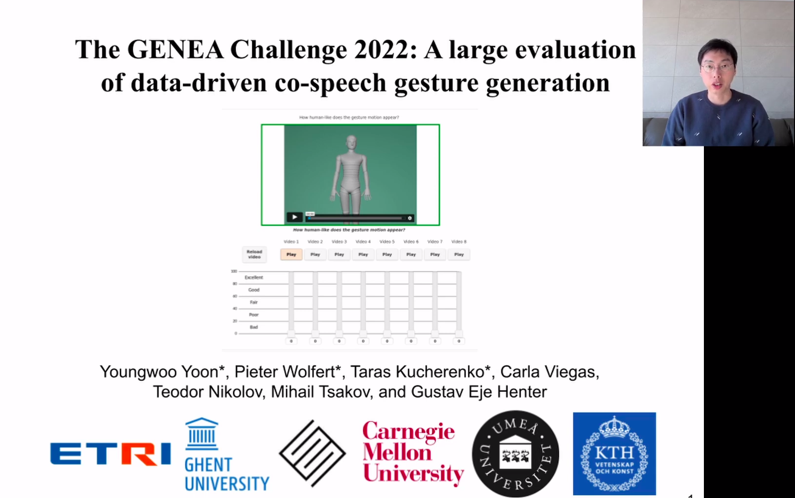
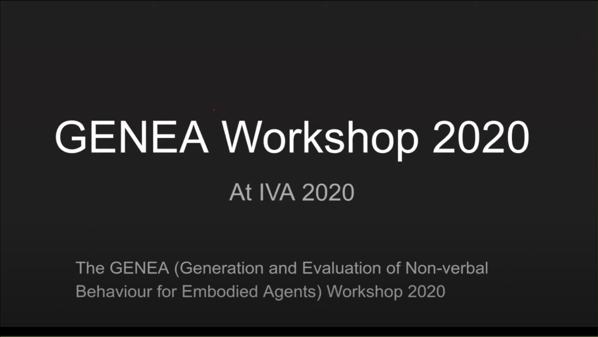

# Awesome Gesture Generation 

**Continuing editing (Not finished yet)**

The goal of project is focus on Audio-driven Gesture Generation with output is 3D keypoints gesture.
 
Input: Audio, Text, Gesture, ..etc. -> Output: Gesture Motion

> **Gesture Generation** is the process of generating gestures from speech or text. The goal of **Gesture Generation** is to generate gestures that are natural, realistic, and appropriate for the given context. The generated gestures can be used to animate virtual characters, robots, or embodied conversational agents.

[ACM CCS](https://dl.acm.org/ccs): • Human-centered computing → Human computer interaction (HCI).

Paper by Folder : [📁/survey](https://github.com/OpenHuman-ai/awesome-gesture_generation/tree/main/survey) || [📁/approach](https://github.com/OpenHuman-ai/awesome-gesture_generation/tree/main/approach) || [📁/papers](https://github.com/OpenHuman-ai/awesome-gesture_generation/tree/main/papers) || [📁/dataset](https://github.com/OpenHuman-ai/awesome-gesture_generation/tree/main/dataset) || [📁/books](https://github.com/OpenHuman-ai/awesome-gesture_generation/tree/main/books)

## Table of Contents

- [1. Survey](#survey)
- [2. Papers](#papers)
  - [Relation of speech and gesture](#fundamental)
  - [GENEA Challenge](#genea)
  - [2023](#2023)
  - [2022](#2022)
  - [2021](#2021)
  - [2020](#2020)
  - [2019](#2019)
  - [2018](#2018)
  - [Before 2017](#2017)
  - [Others](#others)
- [3. Selected Approach](#approachs)
  - [3.1 Selected rule base approach](#rulebase)
  - [3.2 Selected data-driven approach](#datadriven)
    - [3.2.a Statistical approach](#statistical)
    - [3.2.b Deep learning approach](#deeplearning)
- [4. Pipeline](#pipeline)
- [5. Learning objective](#learnobjective)
- [6. Metric Evaluation](#metric)
- [7. Datasets](#datasets)
- [8. Toolkit](#toolkit)
- [9. Playlist & Talks](#talks)
- [10. Code](#code)
- [11. Books](#books)

---

**Main resource**

- [paperswithcode.com/Gesture Generation](https://paperswithcode.com/task/gesture-generation)
- [GENEA Workshop](https://genea-workshop.github.io/)
- [github/topic/gesture-generation](https://github.com/topics/gesture-generation)
- [twitter/WorkshopGENEA](https://twitter.com/workshopgenea)
- [Scholar/gesture generation](https://scholar.google.com/scholar?hl=en&as_sdt=0%2C5&q=Gesture+Generation)

---

<!-- ###################################################### SURVEYS  ###################################################### -->

## <a name="survey">1. Survey</a>

#### **Comprehensive preview**

- 【EUROGRAPHICS 2023】A Comprehensive Review of Data-Driven Co-Speech Gesture Generation; [[paper]](<https://arxiv.org/abs/2301.05339>)

- 2014 - Gesture and speech in interaction: An overview ; [[paper]](<https://www.sciencedirect.com/science/article/abs/pii/S0167639313001295>)

#### **Survey review**

- 【HAI 2021】Speech-based Gesture Generation for Robots and Embodied Agents: A Scoping Review [[paper]](<https://wafa.johal.org/files/papers/Speech_Driven_Gesture_Generation__A_Review.pdf>)

#### **Evaluation survey**

- 【IEEE 2022】 A Review of Evaluation Practices of Gesture Generation in Embodied Conversational Agents [[paper]](https://arxiv.org/pdf/2101.03769.pdf) ;

#### **GENEA Challenge**

- The GENEA Challenge 2020: A large, crowdsourced evaluation of gesture generation systems on common data [[paper]](<https://arxiv.org/abs/2102.11617>) ; [[homepage]](<https://svito-zar.github.io/GENEAchallenge2020/>) ; [[youtube]](<https://www.youtube.com/watch?v=QmaoKRzoVwM>) ; [[Svito-zar/genea_numerical_evaluations]](<https://github.com/Svito-zar/genea_numerical_evaluations>)
- The GENEA Challenge 2022: A large evaluation of data-driven co-speech gesture generation [[paper]](<https://arxiv.org/abs/2208.10441>) ; [[homepage]](<https://youngwoo-yoon.github.io/GENEAchallenge2022/>) ; [[youtube]](<https://www.youtube.com/watch?v=4n02wXGGnd0>) ; [[web]](<https://www.ea.com/seed/news/genea-challenge-2022>)
- The GENEA Challenge 2023: A large-scale evaluation of gesture [[paper]](<https://arxiv.org/pdf/2308.12646.pdf>)
- GENEA Workshop 2021: The 2nd Workshop on Generation and Evaluation of Non-verbal Behaviour for Embodied Agents [[paper]](<https://dl.acm.org/doi/10.1145/3462244.3480983>) ; [[homepage]](<https://genea-workshop.github.io/2021/>)
- Evaluating gesture-generation in a large-scale open challenge - The GENEA Challenge 2022 [[paper]](<https://arxiv.org/pdf/2303.08737>)

<!-- ###################################################### SURVEYS  ###################################################### -->

---

<!-- ###################################################### PAPERS  ###################################################### -->

## <a name="papers">2. Papers</a>

<!-- ************************* Base-paper ************************* -->

### **<a name="fundamental">2.1 Relation of speech and gesture</a>**

- The Relation of Speech and Gestures: Temporal Synchrony Follows Semantic Synchrony [[paper]](<https://core.ac.uk/download/pdf/15945024.pdf>)
- Complexity Matters E05: Complexity Matching and Synchronization between Gestures and Speech [[paper]](<https://www.youtube.com/watch?v=lMb-So8wKS8>)
- Easier Said Than Done? Task Difficulty's Influence on Temporal Alignment, Semantic Similarity, and Complexity Matching Between Gestures and Speech [[paper]](<https://onlinelibrary.wiley.com/doi/full/10.1111/cogs.12989>)
- Advances in Visual Semiotics - The Semiotic Web [[book]](https://books.google.com.vn/books?hl=en&lr=&id=PyH8BQr9VmcC&oi=fnd&pg=PR11&dq=David+McNeill.+1992.+Hand+and+Mind.+Advances+in+Visual+Semiotics+(1992),+351.&ots=W3Qou2m4kp&sig=_dhsTpK4iiJLVeJxwNV6jYq2L_c&redir_esc=y#v=onepage&q=David%20McNeill.%201992.%20Hand%20and%20Mind.%20Advances%20in%20Visual%20Semiotics%20(1992)%2C%20351.&f=false)
- Gestural beats: The rhythm hypothesis [[paper]](https://link.springer.com/article/10.1007/BF02143175)

<!-- ************************* GENEA Challenge ************************* -->

### **<a name="genea">2.2 GENEA</a>**

<!-- ************************* -->

#### GENEA 2023

##### GENEA Challenge 2023 [[Homepage]](<https://genea-workshop.github.io/2023/challenge/>)

| Method (Team\*)              | Paper                                                                                                                                                                                                                  | Video | 🏆  |
| ---------------------------- | ---------------------------------------------------------------------------------------------------------------------------------------------------------------------------------------------------------------------- | ----- | --- |
| FineMotion                   | 【ICMI 2023】The FineMotion entry to the GENEA Challenge 2023: DeepPhase for conversational gestures generation [[paper]](<https://openreview.net/forum?id=pVBKLqpAUtP>)                                               |       |     |
| Gesture Motion Graphs        | 【ICMI 2023】Gesture Motion Graphs for Few-Shot Speech-Driven Gesture Reenactment [[paper]](<https://openreview.net/forum?id=CMivR3x5fpC>)                                                                             |       |     |
| Diffusion-based              | 【ICMI 2023】Diffusion-based co-speech gesture generation using joint text and audio representation [[paper]](<https://openreview.net/forum?id=vD3_u_kbkqS>)                                                           |       |     |
| UEA Digital Humans           | 【ICMI 2023】The UEA Digital Humans entry to the GENEA Challenge 2023 [[paper]](<https://openreview.net/forum?id=bBrebR1YpXe>) ; [[JonathanPWindle/UEA-DH-GENEA23]](https://github.com/JonathanPWindle/uea-dh-genea23) |       |     |
| FEIN-Z                       | 【ICMI 2023】FEIN-Z: Autoregressive Behavior Cloning for Speech-Driven Gesture Generation [[paper]](<https://openreview.net/forum?id=FovoQL3nygw>)                                                                     |       |     |
| DiffuseStyleGesture+         | 【ICMI 2023】The DiffuseStyleGesture+ entry to the GENEA Challenge 2023 [[paper]](<https://openreview.net/forum?id=zrcgseqv0n2>)                                                                                       |       |     |
| Discrete Diffusion           | 【ICMI 2023】Discrete Diffusion for Co-Speech Gesture Synthesis [[paper]](<https://openreview.net/forum?id=xPQcKA56N4j>)                                                                                               |       |     |
| KCL-SAIR                     | 【ICMI 2023】The KCL-SAIR team's entry to the GENEA Challenge 2023 Exploring Role-based Gesture Generation in Dyadic Interactions: Listener vs. Speaker [[paper]](<https://openreview.net/forum?id=oW4rUGjbMYg>)       |       |     |
| Gesture Generation           | 【ICMI 2023】Gesture Generation with Diffusion Models Aided by Speech Activity Information [[paper]](<https://openreview.net/forum?id=S9Efb3MoiZ>)                                                                     |       |     |
| Co-Speech Gesture Generation | 【ICMI 2023】Co-Speech Gesture Generation via Audio and Text Feature Engineering [[paper]](<https://openreview.net/forum?id=mK2qMNf0_Nd>)                                                                              |       |     |
| DiffuGesture                 | 【ICMI 2023】DiffuGesture: Generating Human Gesture From Two-person Dialogue With Diffusion Models [[paper]](<https://openreview.net/forum?id=swc28UDR8Wk>)                                                            |       |     |
| KU-ISPL                      | 【ICMI 2023】The KU-ISPL entry to the GENEA Challenge 2023-A Diffusion Model for Co-speech Gesture generation [[paper]](<https://openreview.net/forum?id=Mm44wlJICIj>)                                                 |       |     |

##### GENEA Workshop 2023 - ICMI 2023 Accepted papers [[Homepage]](<https://genea-workshop.github.io/2023/>)

| Papers                                                                                                                                                                                                                                                                            | Video | 🏆  |
| --------------------------------------------------------------------------------------------------------------------------------------------------------------------------------------------------------------------------------------------------------------------------------- | ----- | --- |
| 【ICMI 2023】 MultiFacet A Multi-Tasking Framework for Speech-to-Sign Language Generation [[paper]](<https://openreview.net/forum?id=2ZRuyknGLy>)                                                                                                                                 |       |     |
| 【ICMI 2023】 Look What I Made It Do - The ModelIT Method for Manually Modeling Nonverbal Behavior of Socially Interactive Agents [[paper]](<https://openreview.net/forum?id=-OmGWX-wRM>)                                                                                         |       |     |
| 【ICMI 2023】 A Methodology for Evaluating Multimodal Referring Expression Generation for Embodied Virtual Agents [[paper]](<https://openreview.net/forum?id=k0lKzukz1E>)                                                                                                         |       |     |
| 【ICMI 2023】 Towards the generation of synchronized and believable non-verbal facial behaviors of a talking virtual agent [[paper]](<https://openreview.net/forum?id=Uz5CrjdU_z>); [[aldelb/non_verbal_facial_animation]](https://github.com/aldelb/non_verbal_facial_animation) |       |     |

<!-- ************************* -->

<!-- ************************* -->

#### GENEA 2022

##### GENEA Challenge 2022 - Accepted papers [[Homepage]](<https://genea-workshop.github.io/2022/challenge/>)

| Team (Method)      | Paper                                                                                                                                                                                                                                                                                                                    | Video                                                      | 🏆  |
| ------------------ | ------------------------------------------------------------------------------------------------------------------------------------------------------------------------------------------------------------------------------------------------------------------------------------------------------------------------ | ---------------------------------------------------------- | --- |
| DeepMotion         | 【ICMI 2022】The DeepMotion entry to the GENEA Challenge 2022 [[paper]](<https://dl.acm.org/doi/abs/10.1145/3536221.3558059>)                                                                                                                                                                                            | [[youtube]](<https://www.youtube.com/watch?v=3L9pyPv-I8M>) |     |
| DSI                | 【ICMI 2022】Hybrid Seq2Seq Architecture for 3D Co-Speech Gesture Generation [[paper]](<https://dl.acm.org/doi/10.1145/3536221.3558064>)                                                                                                                                                                                 | [[youtube]](<https://www.youtube.com/watch?v=9rcBp0ezlqs>) |     |
| FineMotion         | 【ICMI 2022】ReCell: replicating recurrent cell for auto-regressive pose generation [[paper]](<https://dl.acm.org/doi/fullHtml/10.1145/3536220.3558801>) [[FineMotion/GENEA_2022]](<https://github.com/FineMotion/GENEA_2022>)                                                                                           | [[youtube]](<https://www.youtube.com/watch?v=ZVx_QIBR8wQ>) |     |
| Forgerons          | 【ICMI 2022】Ubisoft Exemplar-based Stylized Gesture Generation from Speech: An Entry to the GENEA Challenge 2022 [[paper]](<https://dl.acm.org/doi/abs/10.1145/3536221.3558068>)                                                                                                                                        | [[youtube]](<https://www.youtube.com/watch?v=zdNsj3MGpL0>) |     |
| GestureMaster      | 【ICMI 2022】GestureMaster: Graph-based Speech-driven Gesture Generation [[paper]](<https://dl.acm.org/doi/10.1145/3536221.3558063>)                                                                                                                                                                                     | [[youtube]](<https://www.youtube.com/watch?v=nwNwEGX33SA>) |     |
| IVI Lab            | 【ICMI 2022】The IVI Lab entry to the GENEA Challenge 2022 – A Tacotron2 Based Method for Co-Speech Gesture Generation With Locality-Constraint Attention Mechanism [[paper]](<https://dl.acm.org/doi/abs/10.1145/3536221.3558060>) [[Tacotron2-SpeechGesture]](<https://github.com/cjerry1243/Tacotron2-SpeechGesture>) | [[youtube]](<https://www.youtube.com/watch?v=PNmC6mlpyQg>) | 🏆  |
| ReprGesture        | 【ICMI 2022】The ReprGesture entry to the GENEA Challenge 2022 [[paper]](<https://dl.acm.org/doi/abs/10.1145/3536221.3558066>) [[YoungSeng/ReprGesture]](<https://github.com/YoungSeng/ReprGesture>)                                                                                                                     | [[youtube]](<https://www.youtube.com/watch?v=KJJYEqyOq5U>) |     |
| TransGesture       | 【ICMI 2022】TransGesture: Autoregressive Gesture Generation with RNN-Transducer [[paper]](<https://dl.acm.org/doi/10.1145/3536221.3558061>)                                                                                                                                                                             | [[youtube]](<https://www.youtube.com/watch?v=3aTiuAWDUhs>) |     |
| UEA Digital Humans | 【ICMI 2022】UEA Digital Humans entry to the GENEA Challenge 2022 [[paper]](<https://dl.acm.org/doi/10.1145/3536221.3558065>) [[UEA/GENEA22]](<https://github.com/UEA-digital-human-group/GENEA22>)                                                                                                                      | [[youtube]](<https://www.youtube.com/watch?v=giVYmiglOYI>) |     |

##### GENEA Workshop 2022 - ICMI 2022 Accepted papers [[Homepage]](<https://genea-workshop.github.io/2022/>)

| Papers                                                                                                                                                                                                       | Video                                                      | 🏆  |
| ------------------------------------------------------------------------------------------------------------------------------------------------------------------------------------------------------------ | ---------------------------------------------------------- | --- |
| 【ICMI 2022】 Understanding Interviewees’ Perceptions and Behaviour towards Verbally and Non-verbally Expressive Virtual Interviewing Agents [[paper]](<https://dl.acm.org/doi/abs/10.1145/3536220.3558802>) | [[youtube]](<https://www.youtube.com/watch?v=7Si8j9xxaHE>) |     |
| 【ICMI 2022】 Emotional Respiration Speech Dataset [[paper]](<https://dl.acm.org/doi/fullHtml/10.1145/3536220.3558803>)                                                                                      | [[youtube]](<https://www.youtube.com/watch?v=z5vWO_rQmDI>) |     |
| 【ICMI 2022】 Automatic facial expressions, gaze direction and head movements generation of a virtual agent [[paper]](<https://dl.acm.org/doi/fullHtml/10.1145/3536220.3558806>)                             | [[youtube]](<https://www.youtube.com/watch?v=bo-nDGxLrQU>) | 🏆  |
| 【ICMI 2022】 Can you tell that I'm confused? An overhearer study for German backchannels by an embodied agent [[paper]](<https://dl.acm.org/doi/abs/10.1145/3536220.3558804>)                               | [[youtube]](<https://www.youtube.com/watch?v=vDgo1bXXtOo>) |     |

<!-- ************************* -->

<!-- ************************* -->

#### GENEA 2021

##### GENEA Challenge 2021 - ICMI 2021 Accepted papers [[Homepage]](<https://genea-workshop.github.io/2021/>)

| Papers                                                                                                                                                                                                                                                                | Video                                                      | 🏆  |
| --------------------------------------------------------------------------------------------------------------------------------------------------------------------------------------------------------------------------------------------------------------------- | ---------------------------------------------------------- | --- |
| 【ICMI 2021】 Probabilistic Human-like Gesture Synthesis from Speech using GRU-based WGAN [[paper]](<https://dl.acm.org/doi/abs/10.1145/3461615.3485407>) [[wubowen416/gesture-generation-using-WGAN]](<https://github.com/wubowen416/gesture-generation-using-WGAN>) | [[youtube]](<https://www.youtube.com/watch?v=PMhjX6cdIPE>) | 🏆  |
| 【ICMI 2021】 Influence of Movement Energy and Affect Priming on the Perception of Virtual Characters Extroversion and Mood [[paper]](<https://dl.acm.org/doi/abs/10.1145/3461615.3485409>)                                                                           | ❌                                                         |     |
| 【ICMI 2021】 Crossmodal clustered contrastive learning: Grounding of spoken language to gesture [[paper]](<https://dl.acm.org/doi/abs/10.1145/3461615.3485408>) [[dondongwon/CC_NCE_GENEA]](<https://github.com/dondongwon/CC_NCE_GENEA>)                            | [[youtube]](<https://www.youtube.com/watch?v=L5dHXTpCkeI>) |     |

<!-- ************************* -->

<!-- ************************* -->

#### GENEA 2020

##### GENEA Challenge 2020 - Accepted papers [[Homepage]](<https://genea-workshop.github.io/2020/>)

| Papers                                                                                                                                                                                                        | Video                                                      |
| ------------------------------------------------------------------------------------------------------------------------------------------------------------------------------------------------------------- | ---------------------------------------------------------- |
| 【IVA 2020】 The StyleGestures entry to the GENEA Challenge 2020 [[paper]](<https://zenodo.org/record/4088600>) ; [[[simonalexanderson/StyleGestures]]](<https://github.com/simonalexanderson/StyleGestures>) | [[youtube]](<https://www.youtube.com/watch?v=JZgBlJKGFGk>) |
| 【IVA 2020】 The FineMotion entry to the GENEA Challenge 2020 [[paper]](<https://zenodo.org/record/4088609>) ; [[FineMotion/GENEA_2020]](<https://github.com/FineMotion/GENEA_2020>)                          | [[youtube]](<https://www.youtube.com/watch?v=q29d9Hfbifk>) |
| 【IVA 2020】 Double-DCCCAE: Estimation of Sequential Body Motion Using Wave-Form - AlltheSmooth [[paper]](<https://zenodo.org/record/4088376>)                                                                | [[youtube]](<https://www.youtube.com/watch?v=ht5Fu47JKkI>) |
| 【IVA 2020】 CGVU: Semantics-guided 3D Body Gesture Synthesis [[paper]](<https://zenodo.org/record/4090879>)                                                                                                  | [[youtube]](<https://www.youtube.com/watch?v=MBSX0OLHRRU>) |
| 【IVA 2020】 Interpreting and Generating Gestures with Embodied Human Computer Interactions [[paper]](<https://zenodo.org/record/4088625>)                                                                    | [[youtube]](<https://www.youtube.com/watch?v=5I0FvhlcoDI>) |
| 【IVA 2020】 The Nectec Gesture Generation System entry to the GENEA Challenge 2020 [[paper]](<https://zenodo.org/record/4088629>)                                                                            | [[youtube]](<https://www.youtube.com/watch?v=0m0wKkNmrgQ>) |

<!-- ************************* -->
<!-- ************************* GENEA Challenge ************************* -->

---

<!-- ************************* 2023 ************************* -->

### **<a name="2023">2023</a>**

- 【CVPR 2023】 Co-speech Gesture Synthesis by Reinforcement Learning with Contrastive Pre-trained Rewards [[paper]](<https://batmanzzmc.github.io/assets/pdf/CVPR23.pdf>) ; [[RLracer/RACER]](<https://github.com/RLracer/RACER>)
- 【PAKDD 2023】 RLMixer: A Reinforcement Learning Approach For Integrated Ranking With Contrastive User Preference Modeling [[paper]](<https://batmanzzmc.github.io/assets/pdf/PAKDD2023.pdf>)
- 【IJCAI 2023】 DiffuseStyleGesture - Stylized Audio-Driven Co-Speech Gesture Generation with Diffusion Models [[paper]](<https://arxiv.org/abs/2305.04919>) ; [[YoungSeng/DiffuseStyleGesture]](<https://github.com/YoungSeng/DiffuseStyleGesture>) ; [[youtube]](<https://www.youtube.com/watch?v=Nzom6gkQ2tM>)
- 【CVPR 2023】 Taming Diffusion Models for Audio-Driven Co-Speech Gesture Generation [[paper]](<https://arxiv.org/abs/2303.09119>) ; [[Advocate99/DiffGesture]](<https://github.com/Advocate99/DiffGesture>)
- 【CVPR 2023】 Diverse 3D Hand Gesture Prediction from Body Dynamics by Bilateral Hand Disentanglement [[paper]](<https://arxiv.org/pdf/2303.01765>) ; [[XingqunQi-lab/Diverse-3D-Hand-Gesture-Prediction]](<https://github.com/XingqunQi-lab/Diverse-3D-Hand-Gesture-Prediction>)
- 【CVPR 2023】 QPGesture: Quantization-Based and Phase-Guided Motion Matching for Natural Speech-Driven Gesture Generation [[paper]](https://openaccess.thecvf.com/content/CVPR2023/papers/Yang_QPGesture_Quantization-Based_and_Phase-Guided_Motion_Matching_for_Natural_Speech-Driven_Gesture_CVPR_2023_paper.pdf) ; [[YoungSeng/QPGesture]](https://github.com/YoungSeng/QPGesture) ; [[video]](https://www.youtube.com/watch?v=5GKjFclT618)
- 【CVPR 2023】 GestureDiffuCLIP: Gesture Diffusion Model with CLIP Latents [[paper]](https://arxiv.org/pdf/2303.14613.pdf) ; [[homepage]](https://pku-mocca.github.io/GestureDiffuCLIP-Page/) ; [[video]](https://www.youtube.com/watch?v=513EONcXOck)
- 【CVPR 2023】 Continual Learning for Personalized Co-Speech Gesture Generation [[paper]](https://openaccess.thecvf.com/content/ICCV2023/papers/Ahuja_Continual_Learning_for_Personalized_Co-speech_Gesture_Generation_ICCV_2023_paper.pdf); [[homepage]](https://chahuja.com/cdiffgan/)
- 【CVPR 2023】 Guided Motion Diffusion for Controllable Human Motion Synthesis [[paper]](https://openaccess.thecvf.com/content/ICCV2023/papers/Karunratanakul_Guided_Motion_Diffusion_for_Controllable_Human_Motion_Synthesis_ICCV_2023_paper.pdf) ; [[homepage]](https://korrawe.github.io/gmd-project/)
- 【CVPR 2023】 Sequential Texts Driven Cohesive Motions Synthesis with Natural Transitions [[paper]](https://openaccess.thecvf.com/content/ICCV2023/papers/Li_Sequential_Texts_Driven_Cohesive_Motions_Synthesis_with_Natural_Transitions_ICCV_2023_paper.pdf)
- 【CVPR 2023】 EMMN: Emotional Motion Memory Network for Audio-driven Emotional Talking Face Generation [[paper]](https://openaccess.thecvf.com/content/ICCV2023/papers/Tan_EMMN_Emotional_Motion_Memory_Network_for_Audio-driven_Emotional_Talking_Face_ICCV_2023_paper.pdf)
- 【CVPR 2023】 FineDance: A Fine-grained Choreography Dataset for 3D Full Body Dance Generation [[paper]](https://openaccess.thecvf.com/content/ICCV2023/papers/Li_FineDance_A_Fine-grained_Choreography_Dataset_for_3D_Full_Body_Dance_ICCV_2023_paper.pdf)
- 【CVPR 2023】 Hierarchical Generation of Human-Object Interactions with Diffusion Probabilistic Models [[paper]](https://openaccess.thecvf.com/content/ICCV2023/papers/Pi_Hierarchical_Generation_of_Human-Object_Interactions_with_Diffusion_Probabilistic_Models_ICCV_2023_paper.pdf)
- 【CVPR 2023】 Speech4Mesh: Speech-Assisted Monocular 3D Facial Reconstruction for Speech-Driven 3D Facial Animation [[paper]](https://openaccess.thecvf.com/content/ICCV2023/papers/He_Speech4Mesh_Speech-Assisted_Monocular_3D_Facial_Reconstruction_for_Speech-Driven_3D_Facial_ICCV_2023_paper.pdf)
- 【CVPR 2023】 Semi-supervised Speech-driven 3D Facial Animation via Cross-modal Encoding [[paper]](https://openaccess.thecvf.com/content/ICCV2023/papers/Yang_Semi-supervised_Speech-driven_3D_Facial_Animation_via_Cross-modal_Encoding_ICCV_2023_paper.pdf)
- 【ACM MM 2023】UnifiedGesture - A Unified Gesture Synthesis Model for Multiple Skeletons [[paper]](https://arxiv.org/pdf/2309.07051.pdf) ; [[YoungSeng/UnifiedGesture]](https://github.com/YoungSeng/UnifiedGesture)
- 【ICMI 2023】 AQ-GT: a Temporally Aligned and Quantized GRU-Transformer for Co-Speech Gesture Synthesis [[paper]](https://dl.acm.org/doi/pdf/10.1145/3577190.3614135) ; [[hvoss-techfak/AQGT]](https://github.com/hvoss-techfak/AQGT)
- DiffMotion: Speech-Driven Gesture Synthesis Using Denoising Diffusion Model [[paper]](https://arxiv.org/pdf/2301.10047.pdf)
- BodyFormer: Semantics-guided 3D Body Gesture Synthesis with Transformer [[paper]](https://i.cs.hku.hk/~taku/kunkun2023.pdf)
- EmotionGesture: Audio-Driven Diverse Emotional Co-Speech 3D Gesture Generation [[paper]](https://arxiv.org/pdf/2305.18891.pdf) ;
- Diff-TTSG: Denoising probabilistic integrated speech and gesture synthesis [[paper]](https://arxiv.org/pdf/2306.09417.pdf) ; [[homepage]](https://shivammehta25.github.io/Diff-TTSG/) ; [[video]](https://www.youtube.com/watch?v=xYxcqyMJjsE)
- EMoG: Synthesizing Emotive Co-speech 3D Gesture with Diffusion Model [[paper]](https://arxiv.org/pdf/2306.11496.pdf)
- MRecGen: Multimodal Appropriate Reaction Generator [[paper]](https://arxiv.org/pdf/2307.02609.pdf) ; [[SSYSteve/MRecGen]](https://github.com/SSYSteve/MRecGen)
- Audio is all in one: speech-driven gesture synthetics using WavLM pre-trained model [[paper]](https://arxiv.org/pdf/2308.05995.pdf)
- The KCL-SAIR team’s entry to the GENEA Challenge 2023 Exploring Role-based Gesture Generation in Dyadic Interactions: Listener vs. Speaker [[paper]](https://openreview.net/pdf?id=oW4rUGjbMYg)
- The KU-ISPL entry to the GENEA Challenge 2023-A Diffusion Model for Co-speech Gesture generation [[paper]](https://openreview.net/pdf?id=Mm44wlJICIj)
- Diffusion-Based Co-Speech Gesture Generation Using Joint Text and Audio Representation [[paper]](https://openreview.net/pdf?id=vD3_u_kbkqS)
- Co-Speech Gesture Generation via Audio and Text Feature Engineering [[paper]](https://openreview.net/pdf?id=mK2qMNf0_Nd)
- Gesture Motion Graphs for Few-Shot Speech-Driven Gesture Reenactment [[paper]](https://openreview.net/pdf?id=CMivR3x5fpC)
- Gesture Generation with Diffusion Models Aided by Speech Activity Information [[paper]](https://openreview.net/pdf?id=S9Efb3MoiZ)
- FEIN-Z: Autoregressive Behavior Cloning for Speech-Driven Gesture Generation [[paper]](https://openreview.net/pdf?id=FovoQL3nygw)
- Discrete Diffusion for Co-Speech Gesture Synthesis [[paper]](https://openreview.net/pdf?id=xPQcKA56N4j)
- DiffuGesture: Generating Human Gesture From Two-person Dialogue With Diffusion Models [[paper]](https://openreview.net/pdf?id=swc28UDR8Wk)
- The FineMotion entry to the GENEA Challenge 2023: DeepPhase for conversational gestures generation [[paper]](https://openreview.net/pdf?id=pVBKLqpAUtP)
- Am I listening - Evaluating theQuality of Generated Data-driven Listening Motion [[paper]](https://pieterwolfert.com/files/icmi_2023.pdf)
- Unified speech and gesture synthesis using flow matching [[paper]](https://arxiv.org/pdf/2310.05181.pdf) ; [[homepage]](https://shivammehta25.github.io/Match-TTSG/) ;

<!-- ************************* 2023 ************************* -->

---

<!-- ************************* 2022 ************************* -->

### **<a name="2022">2022</a>**

- 【SIGGRAPH 2022】 A Motion Matching-based Framework for Controllable Gesture Synthesis from Speech [[paper]](<https://dl.acm.org/doi/abs/10.1145/3528233.3530750>) ; [[homepage]](<https://vcai.mpi-inf.mpg.de/projects/SpeechGestureMatching/>)
- 【ICMI 2022】The DeepMotion entry to the GENEA Challenge 2022 [[paper]](<https://dl.acm.org/doi/abs/10.1145/3536221.3558059>)
- 【ICMI 2022】The ReprGesture entry to the GENEA Challenge 2022 [[paper]](<https://arxiv.org/abs/2208.12133>) ; [[YoungSeng/ReprGesture]](https://github.com/YoungSeng/ReprGesture) ; [[youtube]](<https://www.youtube.com/watch?v=KJJYEqyOq5U>)
- 【CVPR 2022】 **HA2G** - Learning Hierarchical Cross-Modal Association for Co-Speech Gesture Generation [[paper]](<https://arxiv.org/abs/2203.13161>) ; [[alvinliu0/HA2G]](https://github.com/alvinliu0/HA2G)
- 【CVPR 2022】 SEEG - SEEG: Semantic Energized Co-Speech Gesture Generation [[paper]](<https://openaccess.thecvf.com/content/CVPR2022/html/Liang_SEEG_Semantic_Energized_Co-Speech_Gesture_Generation_CVPR_2022_paper.html>) ; [[akira-l/seeg]](<https://github.com/akira-l/seeg>)
- 【CVPR 2022】 **DiffGAN** - Low-Resource Adaptation for Personalized Co-Speech Gesture Generation [[paper]](<https://openaccess.thecvf.com/content/CVPR2022/html/Ahuja_Low-Resource_Adaptation_for_Personalized_Co-Speech_Gesture_Generation_CVPR_2022_paper.html>)
- 【CVPR 2022】 Audio-Driven Neural Gesture Reenactment With Video Motion Graphs [[paper]](<https://openaccess.thecvf.com/content/CVPR2022/html/Zhou_Audio-Driven_Neural_Gesture_Reenactment_With_Video_Motion_Graphs_CVPR_2022_paper.html>)
- 【ICMI 2022】 ZeroEGGS Exemplar-based stylized gesture generation from speech: An entry to the GENEA Challenge 2022 [[paper]](<https://dl.acm.org/doi/abs/10.1145/3536221.3558068>)
- 【AAMAS 2022】 Multimodal analysis of the predictability of hand-gesture properties [[paper]](<https://arxiv.org/abs/2108.05762>)
- 【ICMI 2022】 **GestureMaster** GestureMaster: Graph-based Speech-driven Gesture Generation [[paper]](<https://dl.acm.org/doi/abs/10.1145/3536221.3558063>)
- 【ICRA 2022】Context-Aware Body Gesture Generation for Social Robots [[paper]](<https://kclpure.kcl.ac.uk/portal/en/publications/contextaware-body-gesture-generation-for-social-robots(fe4a7b59-027b-4bd8-a751-29cee9777c92).html>)
- 【IROS 2022】Gesture2Vec: Clustering Gestures using Representation Learning Methods for Co-speech Gesture Generation [[paper]](<https://sfumars.com/wp-content/papers/2022_iros_gesture2vec.pdf>) [[pjyazdian/Gesture2Vec]](<https://github.com/pjyazdian/Gesture2Vec>) ; [[youtube]](<https://www.youtube.com/watch?v=ac8jWk4fdCU>) ; [[youtube]](<https://www.youtube.com/watch?v=qFObMpOboCg>)
- Evaluating Data-Driven Co-Speech Gestures of Embodied Conversational Agents through Real-Time Interaction [[paper]](<https://arxiv.org/abs/2210.06974>)
- ZeroEGGS: Zero-shot Example-based Gesture Generation from Speech [[paper]](<https://arxiv.org/abs/2209.07556>) ; [[ubisoft/ubisoft-laforge-ZeroEGGS]](<https://github.com/ubisoft/ubisoft-laforge-ZeroEGGS>) ; [[youtube]](<https://www.youtube.com/watch?v=EJPdTtVrxHo>)
- Voice2Face: Audio-Driven Facial and Tongue Rig Animations [[paper]](<https://media.contentapi.ea.com/content/dam/ea/seed/presentations/seed-sca2022-voice2face-paper.pdf>) ; [[youtube]](<https://www.youtube.com/watch?v=R4CWYAQe4Zs>) ; [[web]](<https://www.ea.com/seed/news/sca22-voice2face-audio-driven-facial-animation>)
- Deep Gesture Generation for Social Robots Using Type-Specific Libraries [[paper]](<https://arxiv.org/abs/2210.06790>) ; [[youtube]](<https://www.youtube.com/watch?v=R4CWYAQe4Zs>) ; [[web]](<https://www.ea.com/seed/news/sca22-voice2face-audio-driven-facial-animation>)
- Automatic text‐to‐gesture rule generation for embodied conversational agents [[paper]](<https://onlinelibrary.wiley.com/doi/abs/10.1002/cav.1944>) [[youtube]](<https://www.youtube.com/watch?v=GIxaI9yTmMc>)
- Evaluating Data-Driven Co-Speech Gestures of Embodied Conversational Agents through Real-Time Interaction [[paper]](<https://arxiv.org/abs/2210.06974>) ; [[web]](<https://www.ea.com/seed/news/evaluating-data-driven-co-speech-gestures>)
- Towards Context-Aware Human-like Pointing Gestures with RL Motion Imitation [[paper]](<https://www.diva-portal.org/smash/record.jsf?pid=diva2:1664509>)
- Text/Speech-Driven Full-Body Animation [[paper]](<https://arxiv.org/abs/2205.15573>)
- Zero-Shot Style Transfer for Gesture Animation driven by Text and Speech using Adversarial Disentanglement of Multimodal Style Encoding [[paper]](<https://arxiv.org/abs/2208.01917>)

<!-- ************************* 2022 ************************* -->

---

<!-- ************************* 2021 ************************* -->

### **<a name="2021">2021</a>**

- 【ICCV 2021】 Speech Drives Templates: Co-Speech Gesture Synthesis With Learned Templates [[paper]](<https://openaccess.thecvf.com/content/ICCV2021/html/Qian_Speech_Drives_Templates_Co-Speech_Gesture_Synthesis_With_Learned_Templates_ICCV_2021_paper.html>) ; [shenhanqian/speechdrivestemplates](https://github.com/shenhanqian/speechdrivestemplates) ; [[youtube]](<https://www.youtube.com/watch?v=yu-5gUHn6h8>) ; [poster](https://shenhanqian.com/assets/2021-07-25-sdt/poster.pdf)
- 【ICCV 2021】 **Audio2Gestures** Audio2Gestures: Generating Diverse Gestures From Speech Audio With Conditional Variational Autoencoders [[paper]](<https://arxiv.org/abs/2108.06720.pdf>)
- 【ICMI 2021】 Probabilistic Human-like Gesture Synthesis from Speech using GRU-based WGAN [[paper]](<https://dl.acm.org/doi/abs/10.1145/3461615.3485407>)
- 【ICMI 2021】 Crossmodal Clustered Contrastive Learning: Grounding of Spoken Language to Gesture [[paper]](<https://dl.acm.org/doi/abs/10.1145/3461615.3485408>) ; [[dondongwon/CC_NCE_GENEA]](<https://github.com/dondongwon/CC_NCE_GENEA>)
- 【IVA 2021】 Speech2Properties2Gestures: Gesture-Property Prediction as a Tool for Generating Representational Gestures from Speech [[paper]](<https://arxiv.org/abs/2106.14736>) ; [[homepage]](<https://svito-zar.github.io/speech2properties2gestures/>)
- 【IVA 2021】 Learning Speech-driven 3D Conversational Gestures from Video [[paper]](<https://dl.acm.org/doi/abs/10.1145/3472306.3478335>)
- 【CASA 2021】 ExpressGesture ExpressGesture: Expressive gesture generation from speech through database matching [[paper]](<https://onlinelibrary.wiley.com/doi/full/10.1002/cav.2016>) ; [[youtube]](<https://www.youtube.com/watch?v=9opZK-usETY>)
- 【AAMAS 2021】 CMCF CCFM: An Architecture for Realtime Gesture Generation by Clustering Gestures by Communicative Function and Motion [[paper]](<https://eprints.gla.ac.uk/253967/1/253967.pdf>)
- 【IEEEVR 2021】 Text2gestures: A transformer-based network for generating emotive body gestures for virtual agents [[paper]](https://arxiv.org/pdf/2101.11101.pdf) ; [[UttaranB127/Text2Gestures]](https://github.com/UttaranB127/Text2Gestures) ; [homepage](https://gamma.umd.edu/researchdirections/affectivecomputing/affagents/t2g/)
- Evaluating Data-Driven Co-Speech Gestures of Embodied Conversational Agents [[paper]](<https://dl.acm.org/doi/abs/10.1145/3514197.3549697>)
- Multimodal analysis of the predictability of hand-gesture properties [[paper]](<https://arxiv.org/abs/2108.05762>)
- Deep Gesture Generation for Social Robots Using Type-Specific Libraries [[paper]](<https://arxiv.org/abs/2210.06790>)
- A Framework for Integrating Gesture Generation Models into Interactive Conversational Agents [[paper]](<https://arxiv.org/abs/2102.12302>) ; [[youtube]](<https://www.youtube.com/watch?v=jhgUBS0125A>) ; [[homepage]](<https://nagyrajmund.github.io/project/gesturebot/>) ; [[nagyrajmund/gesturebot]](<https://github.com/nagyrajmund/gesturebot>)
- Moving Fast and Slow: Analysis of Representations and Post-Processing in Speech-Driven Automatic Gesture Generation [[paper]](<https://www.tandfonline.com/doi/full/10.1080/10447318.2021.1883883>)
- ExpressGesture: Expressive gesture generation from speech through database matching [[paper]](<https://onlinelibrary.wiley.com/doi/full/10.1002/cav.2016>)
- Passing a Non-verbal Turing Test: Evaluating Gesture Animations Generated from Speech [[paper]](<https://arxiv.org/abs/2107.00712>)

<!-- ************************* 2021 ************************* -->

---

<!-- ************************* 2020 ************************* -->

### **<a name="2020">2020</a>**

- 【SIGGRAPH Asia 2020】 **Trimodal** Speech gesture generation from the trimodal context of text, audio, and speaker identity [[paper]](<https://dl.acm.org/doi/abs/10.1145/3414685.3417838>) ; [[ai4r/Gesture-Generation-from-Trimodal-Context]](<https://github.com/ai4r/Gesture-Generation-from-Trimodal-Context>)
- 【ICMI 2020】 **Gesticulator** Gesticulator: A framework for semantically-aware speech-driven gesture generation [[paper]](<https://arxiv.org/abs/2001.09326>) ; [[Svito-zar/gesticulator]](https://github.com/Svito-zar/gesticulator)
- 【ECCV 2020】 **Mix-StAGE** Style Transfer for Co-Speech Gesture Animation: A Multi-Speaker Conditional-Mixture Approach [[paper]](<https://arxiv.org/abs/2007.12553>)
- 【EUROGRAPHICS 2020】 **StyleGestures** Style-Controllable Speech-Driven Gesture Synthesis Using Normalising Flows [[paper]](<https://onlinelibrary.wiley.com/doi/abs/10.1111/cgf.13946>) ; [[simonalexanderson/StyleGestures]](https://github.com/simonalexanderson/StyleGestures) ; [[youtube]](<https://www.youtube.com/watch?v=egf3tjbWBQE>)
- 【EUROGRAPHICS 2020】 **StyleGestures** Style-Controllable Speech-Driven Gesture Synthesis Using Normalising Flows [[paper]](<https://onlinelibrary.wiley.com/doi/abs/10.1111/cgf.13946>) ; [[simonalexanderson/StyleGestures]](https://github.com/simonalexanderson/StyleGestures) ; [[youtube]](<https://www.youtube.com/watch?v=egf3tjbWBQE>)
- 【EMNLP 2020】 AiSLE No Gestures Left Behind: Learning Relationships between Spoken Language and Freeform Gestures [[paper]](<https://aclanthology.org/people/l/louis-philippe-morency/>) ; [[pchahuja/aisle]](<https://github.com/chahuja/aisle>)
- The GENEA Challenge 2020: A large, crowdsourced evaluation of gesture generation systems on common data [[paper]](<https://arxiv.org/abs/2102.11617>) ; [[homepage]](<https://svito-zar.github.io/GENEAchallenge2020/>) ; [[youtube]](<https://www.youtube.com/watch?v=QmaoKRzoVwM>) ; [[youtube]](<https://www.youtube.com/watch?v=Y-5dgBQk34c>) ; [[Svito-zar/genea_numerical_evaluations]](<https://github.com/Svito-zar/genea_numerical_evaluations>)
- Gesticulator: A framework for semantically-aware speech-driven gesture generation [[paper]](<https://arxiv.org/abs/2001.09326>) ; [[youtube]](<https://www.youtube.com/watch?v=VQ8he6jjW08>) ; [[Svito-zar/gesticulator]](<https://github.com/Svito-zar/gesticulator>) ; [[homepage]](<https://svito-zar.github.io/gesticulator/>) ; [[dataset]](https://figshare.com/projects/Gesticulator/87128)
- Probabilistic Multi-modal Interlocutor-aware Generation of Facial Gestures in Dyadic Settings [[paper]](<https://arxiv.org/abs/2006.09888>) ; [[youtube]](<https://www.youtube.com/watch?v=RhazMS4L_bk>) ; [[homepage]](<https://jonepatr.github.io/lets_face_it/>)
- Can we trust online crowdworkers? Comparing online and offline participants in a preference test of virtual agents [[paper]](<https://arxiv.org/pdf/2009.10760.pdf>)
- Affective synthesis and animation of arm gestures from speech prosody [[paper]](<https://www.sciencedirect.com/science/article/abs/pii/S0167639319301980>)
- FineMotion - Audio and Text-Driven approach for Conversational Gestures Generation [[paper]](<https://www.dialog-21.ru/media/5526/korzunvaplusdimovinpluszharkovaa031.pdf>) ; [[FineMotion/GENEA_2020]](<https://github.com/FineMotion/GENEA_2020>)
- Modeling the Conditional Distribution of Co-Speech Upper Body Gesture Jointly Using Conditional-GAN and Unrolled-GAN [[paper]](<https://www.mdpi.com/2079-9292/10/3/228>) ; [[wubowen416/co-speech-gesture-generation-using-CGAN]](<https://github.com/wubowen416/co-speech-gesture-generation-using-CGAN>)
- 【IVA 2020】 Generating coherent spontaneous speech and gesture from text [[paper]](https://arxiv.org/abs/2101.05684) ; [[video]](https://www.youtube.com/watch?v=4_Gq9rU_yWg) ; [[homepage]](https://simonalexanderson.github.io/IVA2020/)

<!-- ************************* 2020 ************************* -->

---

<!-- ************************* 2019 ************************* -->

### **<a name="2019">2019</a>**

- 【SIGGRAPH MIG 2019】 Multi-objective adversarial gesture generation [[paper]](<https://dl.acm.org/doi/abs/10.1145/3359566.3360053>)
- 【ICMI 2019】 DRAM To React or not to React: End-to-End Visual Pose Forecasting for Personalized Avatar during Dyadic Conversations [[paper]](<https://dl.acm.org/doi/abs/10.1145/3340555.3353725>)
- 【CVPR 2019】 **Speech2Gesture** Learning Individual Styles of Conversational Gesture [[paper]](<https://openaccess.thecvf.com/content_CVPR_2019/html/Ginosar_Learning_Individual_Styles_of_Conversational_Gesture_CVPR_2019_paper.html>)
- Analyzing Input and Output Representations for Speech-Driven Gesture Generation [[paper]](<https://arxiv.org/abs/1903.03369>) ; [[GestureGeneration/Speech_driven_gesture_generation_with_autoencoder]](<https://github.com/GestureGeneration/Speech_driven_gesture_generation_with_autoencoder>) ; [[youtube]](<https://www.youtube.com/watch?v=Iv7UBe92zrw>) ; [[youtube]](<https://www.youtube.com/watch?v=tQLVyTVtsSU>) ; [[homepage]](<https://svito-zar.github.io/audio2gestures/>)
- On the Importance of Representations for Speech-Driven Gesture Generation [[paper]](<https://www.ifaamas.org/Proceedings/aamas2019/pdfs/p2072.pdf>)

<!-- ************************* 2019 ************************* -->

---

<!-- ************************* 2018 ************************* -->

### **<a name="2018">2018</a>**

- A Neural Network Approach to Missing Marker Reconstruction in Human Motion Capture [[paper]](<https://arxiv.org/abs/1803.02665>) ; [[youtube]](<https://www.youtube.com/watch?v=mi75gzEhbHI>) ; [[youtube]](<https://www.youtube.com/watch?v=MFdFqxCNhN0>) ; [[Svito-zar/NN-for-Missing-Marker-Reconstruction]](<https://github.com/Svito-zar/NN-for-Missing-Marker-Reconstruction>)
- Data Driven Non-Verbal Behavior Generation for Humanoid Robots [[paper]](<https://dl.acm.org/doi/10.1145/3242969.3264970>)
- A Neural Network Approach to Missing Marker Reconstruction in Human Motion Capture [[paper]](<https://www.researchgate.net/publication/323626902_A_Neural_Network_Approach_to_Missing_Marker_Reconstruction_in_Human_Motion_Capture>) ; [[Svito-zar/NN-for-Missing-Marker-Reconstruction]](<https://github.com/Svito-zar/NN-for-Missing-Marker-Reconstruction>) ; [[youtube]](<https://www.youtube.com/watch?v=mi75gzEhbHI>)
- Evaluation of Speech-to-Gesture Generation Using Bi-Directional LSTM Network [[paper]](<https://dl.acm.org/doi/abs/10.1145/3267851.3267878>)
- A Speech-Driven Hand Gesture Generation Method and Evaluation in Android Robots [[paper]](<https://ieeexplore.ieee.org/abstract/document/8411101>) ; [[youtube]](<https://www.youtube.com/watch?v=nr867hoQB-M>)
- Robots Learn Social Skills: End-to-End Learning of Co-Speech Gesture Generation for Humanoid Robots [[paper]](<https://arxiv.org/abs/1810.12541>)

<!-- ************************* 2018 ************************* -->

---

<!-- ************************* <2017 ************************* -->

### **<a name="2017">Before 2017</a>**

- DCNF Predicting Co-verbal Gestures - A Deep and Temporal Modeling Approach [[paper]](<https://link.springer.com/chapter/10.1007/978-3-319-21996-7_17>)
- 2017 - CDBN Speech-driven animation with meaningful behaviors [[paper]](<https://www.sciencedirect.com/science/article/abs/pii/S0167639318300013>)

<!-- ************************* <2017 ************************* -->

---

<!-- ************************* Others ************************* -->

**<a name="others">Others</a>**

- 【SIGGRAPH 2022】 GANimator for generate data GANimator: Neural Motion Synthesis from a Single Sequence [[paper]](<https://peizhuoli.github.io/ganimator/paper/ganimator-camera-ready.pdf>) ; [PeizhuoLi/ganimator](https://github.com/PeizhuoLi/ganimator) ; [[youtube]](<https://www.youtube.com/watch?v=-VOsJ1KyyGA>)
- 【CVPR 2021】 Body2Hands: Learning To Infer 3D Hands From Conversational Gesture Body Dynamics [[paper]](<https://openaccess.thecvf.com/content/CVPR2021/html/Ng_Body2Hands_Learning_To_Infer_3D_Hands_From_Conversational_Gesture_Body_CVPR_2021_paper.html>)
- Rig Inversion by Training a Differentiable Rig Function [[paper]](<https://arxiv.org/abs/2301.09567>) ; [[youtube]](<https://www.youtube.com/watch?v=sYCz9LGIkuI>)

<!-- ************************* Others ************************* -->

<!-- ###################################################### PAPERS  ###################################################### -->

---

<!-- ###################################################### APPROACHS  ###################################################### -->

## <a name="approachs">3. Approachs</a>

<!-- ************************* Rule Base ************************* -->

### <a name="rulebase"> 3.1 Rule Base approach

- [1994] Rule-based generation of facial expression, gesture & spoken intonation for multiple conversational agents [[paper]](<https://dl.acm.org/doi/10.1145/192161.192272>)

- **Speech to sequence gesture**

  - 【SIGGRAPH 2001】 BEAT: the Behavior Expression Animation Toolkit [[paper]](<https://link.springer.com/chapter/10.1007/978-3-662-08373-4_8>)
  - 【HRI 2012】 Robot Behavior Toolkit: Generating Effective Social Behaviors for Robots [[paper]](<https://dl.acm.org/doi/abs/10.1145/2157689.2157694>)
  - Gesture Generation by Imitation: From Human Behavior to Computer Character Animation [[books]](https://books.google.com.vn/books?hl=en&lr=&id=OIyArJx7mEQC&oi=fnd&pg=PA17&dq=Michael+Kipp.+2004.+Gesture+Generation+by+Imitation:+From+Human+Behavior+to+Computer+Character+Animation.+Dissertation.com,+Boca+Raton.&ots=dP7hbcqhWD&sig=JPwzB4tcMXbRNIHupDAcaE-TA6Q&redir_esc=y#v=onepage&q=Michael%20Kipp.%202004.%20Gesture%20Generation%20by%20Imitation%3A%20From%20Human%20Behavior%20to%20Computer%20Character%20Animation.%20Dissertation.com%2C%20Boca%20Raton.&f=false)

<!-- ************************* Rule Base ************************* -->

---

<!-- ************************* Deep learning ************************* -->

### <a name="datadriven">3.2 Selected data-driven approach

<!-- - -->

#### <a name="statistical">3.2.a Statistical approach

- **Probabilistic model of speech to gesture**

  - 【IVA 2006】 Towards a Common Framework for Multimodal Generation: The Behavior Markup Language [[paper]](<https://link.springer.com/chapter/10.1007/11821830_17>)
  - 【SIGGRAPH 2010】 Gesture Controllers [[paper]](<https://dl.acm.org/doi/abs/10.1145/1833349.1778861>)

- **Probabilistic model of personal style**

  - 【ACM Transactions on Graphics 2008】Gesture modeling and animation based on a probabilistic re-creation of speaker style [[paper]](<https://dl.acm.org/doi/abs/10.1145/1330511.1330516>)

- **Neural classification model of personal style**
  - 【IVA 2015】Predicting Co-verbal Gestures: A Deep and Temporal Modeling Approach [[paper]](<https://link.springer.com/chapter/10.1007/978-3-319-21996-7_17>)

#### <a name="deeplearning">3.2.b Deep learning approach

This section is -- **not accurate** --> continue edditing

- **MLP (Multilayer perceptron)**

  - 【ICMI 2020】 **Gesticulator** Gesticulator: A framework for semantically-aware speech-driven gesture generation [[paper]](<https://arxiv.org/abs/2001.09326>) ; [[Svito-zar/gesticulator]](https://github.com/Svito-zar/gesticulator)

- **RNN (Recurrent Neural Networks)**

  - 【MM 2021】 Speech2AffectiveGestures: Synthesizing Co-Speech Gestures with Generative Adversarial Affective Expression Learning [[paper]](<https://dl.acm.org/doi/pdf/10.1145/3474085.3475223>) ; [[UttaranB127/speech2affective_gestures]](https://github.com/UttaranB127/speech2affective_gestures) ; [[homepage]](https://gamma.umd.edu/researchdirections/affectivecomputing/affagents/s2ag)
  - 【IVA 2018】Evaluation of Speech-to-Gesture Generation Using Bi-Directional LSTM Network [[paper]](<https://dl.acm.org/doi/abs/10.1145/3267851.3267878>)
  - 【CVPR 2022】 **HA2G** - Learning Hierarchical Cross-Modal Association for Co-Speech Gesture Generation [[paper]](<https://arxiv.org/abs/2203.13161>) ; [alvinliu0/HA2G](https://github.com/alvinliu0/HA2G)
  - 【SIGGRAPH Asia 2020】 **Trimodal** Speech gesture generation from the trimodal context of text, audio, and speaker identity [[paper]](<https://dl.acm.org/doi/abs/10.1145/3414685.3417838>) ; [[ai4r/Gesture-Generation-from-Trimodal-Context]](<https://github.com/ai4r/Gesture-Generation-from-Trimodal-Context>)
  - 【ICMI 2022】TransGesture: Autoregressive Gesture Generation with RNN-Transducer [[paper]](<https://dl.acm.org/doi/10.1145/3536221.3558061>)

- **CNN (Convolutional Networks)**

  - 【IVA 2021】 Learning Speech-driven 3D Conversational Gestures from Video [[paper]](https://dl.acm.org/doi/abs/10.1145/3472306.3478335)

- **Transformers**

  - 【IEEEVR 2021】 Text2gestures: A transformer-based network for generating emotive body gestures for virtual agents [[paper]](https://arxiv.org/pdf/2101.11101.pdf) ; [[UttaranB127/Text2Gestures]](https://github.com/UttaranB127/Text2Gestures) ; [homepage](https://gamma.umd.edu/researchdirections/affectivecomputing/affagents/t2g/)

- **Generative models** -- not accurate -- continue edditing

  - **Normalising Flows**

    - 【EUROGRAPHICS 2020】 **StyleGestures** Style-Controllable Speech-Driven Gesture Synthesis Using Normalising Flows [[paper]](<https://onlinelibrary.wiley.com/doi/abs/10.1111/cgf.13946>) ; [[simonalexanderson/StyleGestures]](https://github.com/simonalexanderson/StyleGestures) ; [[youtube]](<https://www.youtube.com/watch?v=egf3tjbWBQE>)

  - **WGAN**

    - 【ICMI 2021】 Probabilistic Human-like Gesture Synthesis from Speech using GRU-based WGAN [[paper]](<https://dl.acm.org/doi/abs/10.1145/3461615.3485407>)

  - **VAEs**

    - 【ICCV 2021】 Audio2Gestures: Generating Diverse Gestures from Speech Audio with Conditional Variational Autoencoders ; [[paper]](https://arxiv.org/pdf/2108.06720.pdf) ; [[JingLi513/Audio2Gestures]](https://github.com/JingLi513/Audio2Gestures) ; [[homepage]](https://jingli513.github.io/audio2gestures/)
    - Freeform Body Motion Generation from Speech [[paper]](https://arxiv.org/pdf/2203.02291) ; [[TheTempAccount/Co-Speech-Motion-Generation]](https://github.com/TheTempAccount/Co-Speech-Motion-Generation) ; [[youtube]](https://www.youtube.com/watch?v=Wb5VYqKX_x0)
    - 【CVMP 2021】 **Flow-VAE** Speech-Driven Conversational Agents using Conditional Flow-VAEs [[paper]](<https://dl.acm.org/doi/10.1145/3485441.3485647>)

  - **Learnable noise codes**

    - 【ICCV 2021】 Speech Drives Templates: Co-Speech Gesture Synthesis With Learned Templates ; [[paper]](https://arxiv.org/pdf/2108.08020.pdf) ; [[ShenhanQian/SpeechDrivesTemplates]](https://github.com/ShenhanQian/SpeechDrivesTemplates) ;

  - **CaMN** BEAT: A Large-Scale Semantic and Emotional Multi-Modal Dataset for Conversational Gestures Synthesis [[paper]](<https://arxiv.org/abs/2203.05297v5>) ; [[PantoMatrix/BEAT]](<https://github.com/PantoMatrix/BEAT>)

- **Diffusion**

  - 【SIGGRAPH 2023】 Listen, denoise, action! Audio-driven motion synthesis with diffusion models [[paper]](https://arxiv.org/abs/2211.09707.pdf) ; [(Code repository (coming soon))](#) ; [[youtube]](<https://www.youtube.com/watch?v=Qfd2EpzWgok>) ; [[homepage]](https://www.speech.kth.se/research/listen-denoise-action/) ; [[video]](https://www.youtube.com/watch?v=Qfd2EpzWgok)
  - 【IJCAI 2023】 DiffuseStyleGesture: Stylized Audio-Driven Co-Speech Gesture Generation with Diffusion Models [[paper]](<https://arxiv.org/abs/2305.04919>) ; [youngseng/diffusestylegesture](https://github.com/youngseng/diffusestylegesture) ; [[youtube]](<https://www.youtube.com/watch?v=Nzom6gkQ2tM>)
  - 【CVPR 2023】 Taming Diffusion Models for Audio-Driven Co-Speech Gesture Generation [[paper]](<https://arxiv.org/pdf/2303.09119v2.pdf>) ; [[advocate99/diffgesture]](<https://github.com/advocate99/diffgesture>)

- **Periodic autoencoders (DeepPhase)**

  - **Rhythmic Gesticulator** - Rhythmic Gesticulator: Rhythm-Aware Co-Speech Gesture Synthesis with Hierarchical Neural Embeddings [[paper]](<https://arxiv.org/abs/2210.01448>) ; [[Aubrey-ao/HumanBehaviorAnimation]](https://github.com/aubrey-ao/humanbehavioranimation) ; [[youtube]](<https://www.youtube.com/watch?v=qy2MrNhsoIs>) ; [[youtube]](<https://www.youtube.com/watch?v=DO_W8plFWco>)
  - 【CVPR 2023】QPGesture: Quantization-Based and Phase-Guided Motion Matching for Natural Speech-Driven Gesture Generation [[paper]](https://openaccess.thecvf.com/content/CVPR2023/papers/Yang_QPGesture_Quantization-Based_and_Phase-Guided_Motion_Matching_for_Natural_Speech-Driven_Gesture_CVPR_2023_paper.pdf) ; [[YoungSeng/QPGesture]](https://github.com/YoungSeng/QPGesture) ; [[video]](https://www.youtube.com/watch?v=5GKjFclT618)

- **Text to Gesture**

  - 【CVPR 2022】 Generating Diverse and Natural 3D Human Motions from Text [[paper]](https://openaccess.thecvf.com/content/CVPR2022/papers/Guo_Generating_Diverse_and_Natural_3D_Human_Motions_From_Text_CVPR_2022_paper.pdf) [[homepage]](https://ericguo5513.github.io/text-to-motion/) ; [[poster]](https://ericguo5513.github.io/text-to-motion/Poster_CVPR2022.pdf) ; [[EricGuo5513/text-to-motion]](https://github.com/EricGuo5513/text-to-motion)

<!-- Uncategory -->

- **Others (Uncategory)**

  - 【SIGGRAPH 2022】 A Motion Matching-based Framework for Controllable Gesture Synthesis from Speech [[paper]](<https://dl.acm.org/doi/abs/10.1145/3528233.3530750>) ; [[homepage]](<https://vcai.mpi-inf.mpg.de/projects/SpeechGestureMatching/>)
  - 【CVPR 2022】 SEEG - SEEG: Semantic Energized Co-Speech Gesture Generation [[paper]](<https://openaccess.thecvf.com/content/CVPR2022/html/Liang_SEEG_Semantic_Energized_Co-Speech_Gesture_Generation_CVPR_2022_paper.html>) ; [[akira-l/seeg]](<https://github.com/akira-l/seeg>)
  - 【CVPR 2022】 **DiffGAN** - Low-Resource Adaptation for Personalized Co-Speech Gesture Generation [[paper]](<https://openaccess.thecvf.com/content/CVPR2022/html/Ahuja_Low-Resource_Adaptation_for_Personalized_Co-Speech_Gesture_Generation_CVPR_2022_paper.html>)
  - 【ICMI 2022】 ZeroEGGS Exemplar-based stylized gesture generation from speech: An entry to the GENEA Challenge 2022 [[paper]](<https://dl.acm.org/doi/abs/10.1145/3536221.3558068>)
  - 【CVPR 2022】 Audio-Driven Neural Gesture Reenactment With Video Motion Graphs [[paper]](<https://openaccess.thecvf.com/content/CVPR2022/html/Zhou_Audio-Driven_Neural_Gesture_Reenactment_With_Video_Motion_Graphs_CVPR_2022_paper.html>)
  - 【AAMAS 2022】 Multimodal analysis of the predictability of hand-gesture properties [[paper]](<https://arxiv.org/abs/2108.05762>)
  - 【ICMI 2022】 **GestureMaster** GestureMaster: Graph-based Speech-driven Gesture Generation [[paper]](<https://dl.acm.org/doi/abs/10.1145/3536221.3558063>)

  - 【ICCV 2021】 **Audio2Gestures** Audio2Gestures: Generating Diverse Gestures From Speech Audio With Conditional Variational Autoencoders [[paper]](<https://openaccess.thecvf.com/content/ICCV2021/html/Li_Audio2Gestures_Generating_Diverse_Gestures_From_Speech_Audio_With_Conditional_Variational_ICCV_2021_paper.html>)
  - 【IVA 2021】 Speech2Properties2Gestures: Gesture-Property Prediction as a Tool for Generating Representational Gestures from Speech [[paper]](<https://arxiv.org/abs/2106.14736>) ; [[homepage]](<https://svito-zar.github.io/speech2properties2gestures/>)
  - 【ECCV 2020】 **Mix-StAGE** Style Transfer for Co-Speech Gesture Animation: A Multi-Speaker Conditional-Mixture Approach [[paper]](<https://arxiv.org/abs/2007.12553>)
  - 【CVPR 2019】 **Speech2Gesture** Learning Individual Styles of Conversational Gesture [[paper]](<https://openaccess.thecvf.com/content_CVPR_2019/html/Ginosar_Learning_Individual_Styles_of_Conversational_Gesture_CVPR_2019_paper.html>)

---

<!-- ************************* Deep learning ************************* -->

<!-- ###################################################### APPROACHS  ###################################################### -->

<!-- ###################################################### PIPELINES  ###################################################### -->

## <a name="pipeline">4. Pipelines

-

<!-- ###################################################### PIPELINES  ###################################################### -->

---

<!-- ###################################################### LEARNING OBJECTED  ###################################################### -->

## <a name="learnobjective"> 5. Learning Objective

- [**Fréchet Inception Distance (FID)**](https://arxiv.org/abs/1706.08500) - 
- [**Fréchet Gesture Distance (FGD)**](https://arxiv.org/abs/2009.02119) -
- [**Fréchet Template Distance (FTD)**](https://arxiv.org/abs/2108.08020) - 

| Full name                                                     | Description                                                                                                                                                                                                                                                                 |
| ------------------------------------------------------------- | --------------------------------------------------------------------------------------------------------------------------------------------------------------------------------------------------------------------------------------------------------------------------- |
| Adversarial Loss (**Adv**)                                    | Used in Generative Adversarial Networks (GANs), this loss function pits a generator network against a discriminator network, with the goal of the generator producing samples that can fool the discriminator into thinking they are real.                                  |
| Categorical Cross Entropy (**CCE**)                           | A common loss function used in multi-class classification tasks, where the goal is to minimize the difference between the predicted and true class labels.                                                                                                                  |
| Cross-modal Cluster Noise Contrastive Estimation (**CC-NCE**) | Used in multimodal learning to learn joint representations across different modalities, this loss function maximizes the similarity between matching modalities while minimizing the similarity between non-matching modalities.                                            |
| Edge Transition Cost (**ETC**)                                | Used in graph-based image segmentation, this loss function measures the similarity between adjacent pixels in an image to preserve the coherence and smoothness of segmented regions.                                                                                       |
| Expectation Maximization (**EM**)                             | Used for maximum likelihood estimation when dealing with incomplete or missing data, this algorithm involves computing the expected likelihood of the missing data and updating model parameters to maximize the likelihood of the observed data given the expected values. |
| Geodesic Distance (**GeoD**)                                  | Used in deep learning for image segmentation, this loss function penalizes the discrepancy between the predicted segmentation map and the ground truth, while also considering the spatial relationships between different image regions.                                   |
| Wasserstein-GAN Gradient Penalty (**WGAN-GP**)                | An extension of the Wasserstein GAN algorithm that adds a gradient penalty term to the loss function, used to enforce the Lipschitz continuity constraint and ensure stability during training.                                                                             |
| Hamming Distance (**Hamm**)                                   | Used in information theory, this metric measures the number of positions at which two strings differ.                                                                                                                                                                       |
| Huber Loss (**Huber**)                                        | A robust loss function used in regression tasks that is less sensitive to outliers than the Mean Squared Error (MSE) loss.                                                                                                                                                  |
| Imitation Reward (**IR**)                                     | Used in imitation learning to train a model to mimic the behavior of an expert agent, by providing a reward signal based on how closely the model's behavior matches that of the expert.                                                                                    |
| Kullback–Leibler Divergence (**KL**)                          | Used to measure the difference between two probability distributions, this loss function is commonly used in probabilistic models and deep learning for regularization and training.                                                                                        |
| L2 Distance (**L2**)                                          | Measures the Euclidean distance between two points in space, commonly used in regression tasks.                                                                                                                                                                             |
| Mean Absolute Error (**MAE**)                                 | A loss function used in regression tasks that measures the average difference between the predicted and true values.                                                                                                                                                        |
| Maximum Likelihood Estimation (**MLE**)                       | A statistical method used to estimate the parameters of a probability distribution that maximize the likelihood of observing the data.                                                                                                                                      |
| Mean Squared Error (**MSE**)                                  | A common loss function used in regression tasks that measures the average squared difference between the predicted and true values.                                                                                                                                         |
| Negative Log-likelihood (**NLL**)                             | Used in probabilistic models to maximize the likelihood of the observed data by minimizing the negative log-likelihood.                                                                                                                                                     |
| Structural Similarity Index Measure (**SIMM**)                | Used in image processing to measure the similarity between two images based on their luminance, contrast, and structural content.                                                                                                                                           |
| Task Reward (**TR**)                                          | Used in reinforcement learning to provide a reward signal to an agent based on its performance in completing a given task.                                                                                                                                                  |
| Variance (**Var**)                                            | A statistical metric used to measure the variability of a set of data points around their mean.                                                                                                                                                                             |
| Within-cluster Sum of Squares (**WCSS**)                      | Used in cluster analysis to measure the variability of data points within a cluster by computing the sum of squared distances between each data point and the mean of the cluster.                                                                                          |

<!-- ###################################################### LEARNING OBJECTED  ###################################################### -->

---

<!-- ###################################################### METRIC  ###################################################### -->

## <a name="metric"> 5. Metric Evaluation</a>

### Evaluation aspects

- Human-likeness : looks like the motion of a real human
- Appropriateness (specificity) : appropriate for the given speech, controlling for the human-likeness of the motion

  - 🧑‍🦲 : Upper-body tier || 🧍 : Full-body tier

  - 🧍‍♂️ : motion || 📃 : text || 🔊 : audio || ⚙️ : custom by teams

| Metric (Description)             | Body tier | Type | 2020 | 2021 | 2022 | 2023 |
| -------------------------------- | --------- | ---- | ---- | ---- | ---- | ---- |
| FNA (Full-body Natural Motion )  | 🧍        | 🧍‍♂️   |      |      |      |      |
| FBT (Full-body Text-based )      | 🧍        | 📃   |      |      |      |      |
| FSA (Full-body Custom by Teams ) | 🧍        | ⚙    |      |      |      |      |
| FSB (Full-body Custom by Teams ) | 🧍        | ⚙️   |      |      |      |      |
| FSC (Full-body Custom by Teams ) | 🧍        | ⚙️   |      |      |      |      |
| FSD (Full-body Custom by Teams ) | 🧍        | ⚙️   |      |      |      |      |
| FSF (Full-body Custom by Teams ) | 🧍        | ⚙️   |      |      |      |      |
| FSG (Full-body Custom by Teams ) | 🧍        | ⚙️   |      |      |      |      |
| FSH (Full-body Custom by Teams ) | 🧍        | ⚙️   |      |      |      |      |
| FSI (Full-body Custom by Teams ) | 🧍        | ⚙️   |      |      |      |      |
| UNA (Upper-body Natural Motion ) | 🧑‍🦲        | 🧍‍♂️   |      |      |      |      |
| UBA (Upper-body Audio-based )    | 🧑‍🦲        | 🔊   |      |      |      |      |
| UBT (Upper-body Text-based )     | 🧑‍🦲        | 📃   |      |      |      |      |
| USJ (Upper-body Custom by Teams) | 🧑‍🦲        | ⚙️   |      |      |      |      |
| USK (Upper-body Custom by Teams) | 🧑‍🦲        | ⚙️   |      |      |      |      |
| USL (Upper-body Custom by Teams) | 🧑‍🦲        | ⚙️   |      |      |      |      |
| USM (Upper-body Custom by Teams) | 🧑‍🦲        | ⚙️   |      |      |      |      |
| USN (Upper-body Custom by Teams) | 🧑‍🦲        | ⚙️   |      |      |      |      |
| USO (Upper-body Custom by Teams) | 🧑‍🦲        | ⚙️   |      |      |      |      |
| USP (Upper-body Custom by Teams) | 🧑‍🦲        | ⚙️   |      |      |      |      |
| USQ (Upper-body Custom by Teams) | 🧑‍🦲        | ⚙️   |      |      |      |      |

### Objective metrics

<!-- | Metric | Description |
| ------ | ----------- |
|        |             |
|        |             |
|        |             |
|        |             |
|        |             | -->

#### 3.1 Average acceleration and jerk

#### 3.2 Comparing speed histograms

#### 3.3 Canonical correlation analysis

#### 3.4 Fréchet gesture distance

#### 3.5 System ranking comparison

- Canonical correlation analysis

<!-- ###################################################### METRIC  ###################################################### -->

---

<!-- ###################################################### DATASETS  ###################################################### -->

## <a name="datasets">4. Datasets</a>

- **Modalities type**:

  - 🔊 : audio || 📃 : text || 🤯 : emotion || 🚶 : gesture motion || ℹ️ : gesture properties || 🎞️ : gesture segment

- **Type**

  - 👥 : Dialog (Conversation between two people 🤼) || 👤 : Monolog (Self conversation 🧍)

| Dataset                                                                                                                                                                           | Modalities         | Type   | Download                                                                                                                                 | Paper                                                                                             |
| --------------------------------------------------------------------------------------------------------------------------------------------------------------------------------- | ------------------ | ------ | ---------------------------------------------------------------------------------------------------------------------------------------- | ------------------------------------------------------------------------------------------------- |
| IEMOCAP                                                                                                                                                                           | 🚶, 🔊, 📃, 🤯     | 👥     | [sail.usc.edu/iemocap](https://sail.usc.edu/iemocap)                                                                                     | [[paper]](<https://arxiv.org/pdf/1810.12541.pdf>)                                                 |
| Creative-IT                                                                                                                                                                       | 🚶, 🔊, 📃, 🤯     | 👥     | [sail.usc.edu/CreativeIT](https://sail.usc.edu/CreativeIT/ImprovRelease.htm)                                                             |                                                                                                   |
| Gesture-Speech Dataset                                                                                                                                                            | 🚶, 🔊             | 👤     | [dropbox](https://www.dropbox.com/sh/j419kp4m8hkt9nd/AAC_pIcS1b_WFBqUp5ofBG1Ia?dl=0)                                                     |                                                                                                   |
| CMU Panoptic                                                                                                                                                                      | 🚶, 🔊, 📃         | 👥     | [domedb.perception.cmu](http://domedb.perception.cs.cmu.edu)                                                                             | [[paper]](<https://arxiv.org/abs/1612.03153>)                                                     |
| Speech-Gesture                                                                                                                                                                    | 🚶, 🔊             | 👤     | [amirbar/speech2gesture](https://github.com/amirbar/speech2gesture)                                                                      | [[paper]](<https://arxiv.org/abs/1906.04160>)                                                     |
| TED Dataset [[homepage]](<https://sites.google.com/view/youngwoo-yoon/projects/co-speech-gesture-generation>)                                                                     | 🚶, 🔊             | 👤     | [youtube-gesture-dataset](https://github.com/youngwoo-yoon/youtube-gesture-dataset)                                                      |                                                                                                   |
| Talking With Hands ([[github]](<https://github.com/facebookresearch/TalkingWithHands32M>))                                                                                        | 🚶, 🔊             | 👥     | [facebookresearch/TalkingWithHands32M](https://github.com/facebookresearch/TalkingWithHands32M)                                          | [[paper]](<https://personalrobotics.cs.washington.edu/publications/lee2019handmotiondataset.pdf>) |
| PATS ([[homepage]](<https://chahuja.com/pats/>), [[github]](<https://github.com/chahuja/pats>))                                                                                   | 🚶, 🔊, 📃         | 👤     | [chahuja.com/pats](https://chahuja.com/pats)                                                                                             | [[paper]](<https://arxiv.org/pdf/2007.12553v1.pdf>)                                               |
| Trinity Speech-Gesture I                                                                                                                                                          | 🚶, 🔊, 📃         | 👤     | [Trinity Speech-Gesture I](https://trinityspeechgesture.scss.tcd.ie/data/Trinity%20Speech-Gesture%20I/GENEA_Challenge_2020_data_release) |                                                                                                   |
| Trinity Speech-Gesture II                                                                                                                                                         | 🚶, 🔊, 🎞️         | 👤     | [Trinity Speech GestureII](https://trinityspeechgesture.scss.tcd.ie/data/Trinity%20Speech-Gesture%20II)                                  |                                                                                                   |
| Speech-Gesture 3D extension                                                                                                                                                       | 🚶, 🔊             | 👤     | [nextcloud.mpi-klsb](https://nextcloud.mpi-klsb.mpg.de/index.php/s/7LzxGSepzrndg2x)                                                      |                                                                                                   |
| Talking With Hands GENEA Extension                                                                                                                                                | 🚶, 🔊, 📃         | 👥     | [zenodo/6998231](https://zenodo.org/record/6998231)                                                                                      | [[paper]](<https://dl.acm.org/doi/abs/10.1145/3536221.3558068>)                                   |
| SaGA                                                                                                                                                                              | 🚶, 🔊, ℹ️         | 👥     | [phonetik.uni-muenchen](https://www.phonetik.uni-muenchen.de/Bas/BasSaGAeng.html)                                                        | [[paper]](<https://pub.uni-bielefeld.de/record/2001935>)                                          |
| SaGA++                                                                                                                                                                            | 🚶, 🔊, ℹ️         | 👥     | [zenodo/6546229](https://zenodo.org/record/6546229)                                                                                      |                                                                                                   |
| ZEGGS Dataset [[youtube]](<https://www.youtube.com/watch?v=YFg7QKWkjwQ>)                                                                                                          | 🚶, 🔊             | 👤     | [ubisoft-laforge-ZeroEGGS](https://github.com/ubisoft/ubisoft-laforge-ZeroEGGS)                                                          | [[paper]](<https://arxiv.org/abs/2209.07556>)                                                     |
| BEAT Dataset ([[homepage]](<https://pantomatrix.github.io/BEAT-Dataset/>) [[homepage]](<https://pantomatrix.github.io/BEAT/>), [[github]](<https://github.com/PantoMatrix/BEAT>)) | 🚶, 🔊, 📃, ℹ️, 🤯 | 👥, 👤 | [github.io/BEAT](https://pantomatrix.github.io/BEAT)                                                                                     | [[paper]](<https://arxiv.org/pdf/2203.05297.pdf>)                                                 |

### 2022 GENEA Challenge

- Challenge dataset: [GENEA Challenge 2022 Dataset Files](https://zenodo.org/record/6998231)
- 3D coordinates of submitted motion: [GENEA Challenge 2022 3D coordinates of submitted motion](https://zenodo.org/record/6973297)
- Submitted BVH files: [GENEA Challenge 2022 submitted BVH files](https://zenodo.org/record/6977157)
- User-study video stimuli: [GENEA Challenge 2022 user-study video stimuli](https://zenodo.org/record/6997926)

<!-- ###################################################### DATASETS  ###################################################### -->

---

<!-- ###################################################### TOOLKIT  ###################################################### -->

## 5. Toolkit

- Algorithms

  - SGToolkit: An Interactive Gesture Authoring Toolkit for Embodied Conversational Agents [[paper]](<https://github.com/ai4r/SGToolkit>) ; [[homepage]](<https://uist.acm.org/uist2021/>) ; [[youtube]](<https://www.youtube.com/watch?v=qClSOtLiVlc>)

- Recognition:

  - OpenPose - [CMU-Perceptual-Computing-Lab/openpose](https://github.com/CMU-Perceptual-Computing-Lab/openpose)
  - MMPose - [open-mmlab/mmpose](https://github.com/open-mmlab/mmpose)
  - AlphaPose - [MVIG-SJTU/AlphaPose](https://github.com/MVIG-SJTU/AlphaPose)

- Audio pre-processing:

  -

- Mesh processing:

  - Utility to trim BVH files: [github.com/ghenter/trim_bvh](https://github.com/ghenter/trim_bvh)

- Visualization:
  - [github.com/TeoNikolov/genea_visualizer](https://github.com/TeoNikolov/genea_visualizer)
  - [ICMI 2021] [HEMVIP: Human Evaluation of Multiple Videos in Parallel](https://dl.acm.org/doi/pdf/10.1145/3462244.3479957) ; [[jonepatr/hemvip/]](https://github.com/jonepatr/hemvip/) ; [[data and analysis code]](https://zenodo.org/record/5196582)

<!-- ###################################################### TOOLKIT  ###################################################### -->

<!-- ######################## TALKS  ########################### -->

## <a name="talks">9. Playlist & Talks</a>

### GENEA

#### GENEA 2022 Playlist

- [The GENEA Challenge 2022 Playlist](https://www.youtube.com/watch?v=SDw70iNH6cM&list=PLaTrbkxf82xaNqhwVlX9LwLaKTLX-5izq)

- [GENEA Workshop 2022 Playlist](https://www.youtube.com/playlist?list=PLaTrbkxf82xYiM6iB9u5YYyrFoHC6ioa_)

#### GENEA 2021 Playlist

<!-- - [The GENEA Challenge 2021]() -->

- [GENEA 2021: Crossmodal clustered contrastive learning: Grounding of spoken language to gesture](https://www.youtube.com/watch?v=L5dHXTpCkeI)

#### GENEA 2020 Playlist

- [GENEA Workshop 2020 Playlist](https://www.youtube.com/watch?v=8lED4n12BAA&list=PLaTrbkxf82xZL2TZLX7wChJ6jKADb80bc)

### SIGGRAPH

#### ACM SIGGRAPH MIG 2019 Playlist

<!-- ######################## CODE  ########################### -->

## <a name="code">10. Code</a>

- Objective evaluation code: [github.com/genea-workshop/genea_numerical_evaluations](https://github.com/genea-workshop/genea_numerical_evaluations)
- Text-based baseline: [github.com/youngwoo-yoon/Co-Speech_Gesture_Generation](https://github.com/youngwoo-yoon/Co-Speech_Gesture_Generation)
- Audio-based baseline: [github.com/genea-workshop/Speech_driven_gesture_generation_with_autoencoder](https://github.com/genea-workshop/Speech_driven_gesture_generation_with_autoencoder/tree/GENEA_2022)
- Interface for subjective evaluations: [jonepatr/hemvip](https://github.com/jonepatr/hemvip/tree/genea2022)
- Code for creating attention-check videos: [youngwoo-yoon/create_attention_check](https://github.com/youngwoo-yoon/create_attention_check)
- Utility to trim BVH files: [github.com/ghenter/trim_bvh](https://github.com/ghenter/trim_bvh)
- Modified PyMO for the challenge dataset: [youngwoo-yoon/PyMO](https://github.com/youngwoo-yoon/PyMO)

<!-- $l_{G e n}^{S R}=\sum_{n=1}^N-\log D_{\theta_D}\left(G_{\theta_G}\left(I^{L R}\right)\right)$                                                                                                                                                                                                              |
$Loss = -\sum_{i=1}^{\text{output size}} y_i \cdot \log \hat{y}_i$                                                                                                                                                                                                                                         |
$L = -log(\frac{s}{(s + n)})$                                                                                                                                                                                                                                                                              |
$L*{E T C}=\sum_c \sum*{i, j} w\_{i j}\left(y_i \neq y_j\right) \exp \left(-\lambda\left \| I_i-I_j\right \| ^2\right)$                                                                                                                                                                                    |
$L_{EM}=−log_p ( X ∣ θ )$ $Q\left(\theta \mid \theta^{(t)}\right)=\mathbb{E}_{Z \mid X, \theta^{(t)}}[\log p(X, Z \mid \theta)]$                                                                                                                                                                           |
$L_{G D}=\frac{1}{N} \sum_{i=1}^N \sum_{j=1}^N D_{i j} \cdot \mathbb{I}_{i \neq j} \cdot \mathbb{I}_{y_i=y_j}$                                                                                                                     s                                                                        |
$L_{W G A N-G P}=-\mathbb{E}_{\mathbf{x} \sim p_{\text {data }}}[D(\mathbf{x})]+\mathbb{E}_{\mathbf{z} \sim p_{\mathbf{z}}}[D(G(\mathbf{z}))]+\lambda \mathbb{E}_{\hat{\mathbf{x}} \sim p_{\hat{\mathbf{x}}}}\left[\left(\left\|\nabla_{\hat{\mathbf{x}}} D(\hat{\mathbf{x}})\right\|_2-1\right)^2\right]$ | -->

<!-- ######################## CODE  ########################### -->

## <a name="books">11. Books</a>

- 2000 - [Paired Speech and Gesture Generation in Embodied Conversational Agents](https://www.google.com/books/edition/Paired_Speech_and_Gesture_Generation_in/LgrmtgAACAAJ)
- 2005 - [Gesture Generation by Imitation: From Human Behavior to Computer Character Animation](https://www.semanticscholar.org/paper/Gesture-generation-by-imitation%3A-from-human-to-Kipp/32d19b46dfef6ec36040986df955866f13699039)
- 2009 - [Gesture in Embodied Communication and Human Computer Interaction](https://www.google.com/books/edition/Gesture_in_Embodied_Communication_and_Hu/vLqoCAAAQBAJ?hl=en&gbpv=0)
- 2013 - [Nonverbal Communication in Human Interaction](https://books.google.co.uk/books?id=-g7hkSR_mLoC)
- 2013 - [Nonverbal Communication: Science and Applications](https://books.google.co.uk/books?id=PeOeu3qFFTIC)

---

<!-- ************************* PapersWithCode ************************* -->

### **PapersWithCode Ranking**

- **TEDTalk** (Extract skeleton from video Dataset)

  - AQ-GT: a Temporally Aligned and Quantized GRU-Transformer for Co-Speech Gesture Synthesis [[paper]](https://dl.acm.org/doi/pdf/10.1145/3577190.3614135) ; [[hvoss-techfak/AQGT]](https://github.com/hvoss-techfak/AQGT)
  - Rhythmic Gesticulator: Rhythm-Aware Co-Speech Gesture Synthesis with Hierarchical Neural Embeddings [[paper]](<https://arxiv.org/abs/2210.01448>) ; [[aubrey-ao/humanbehavioranimation]](<https://github.com/aubrey-ao/humanbehavioranimation>) ; [[youtube]](<https://www.youtube.com/watch?v=qy2MrNhsoIs>)
  - Learning Hierarchical Cross-Modal Association for Co-Speech Gesture Generation [[paper]](<https://arxiv.org/pdf/2203.13161.pdf>) [alvinliu0/HA2G](https://github.com/alvinliu0/HA2G) ; [[youtube]](https://www.youtube.com/watch?v=CG632W-nIWk) ; [[homepage]](<https://alvinliu0.github.io/projects/HA2G>)
  - Speech2AffectiveGestures: Synthesizing Co-Speech Gestures with Generative Adversarial Affective Expression Learning [[paper]](<https://arxiv.org/abs/2108.00262v2>) [[UttaranB127/speech2affective_gestures]](<https://github.com/UttaranB127/speech2affective_gestures>) ; [[homepage]](<https://gamma.umd.edu/researchdirections/affectivecomputing/affagents/s2ag/>) ; [[youtube]](<https://www.youtube.com/watch?v=D_w1FtIVvQ8>)
  - Speech Gesture Generation from the Trimodal Context of Text, Audio, and Speaker Identity [[paper]](<https://arxiv.org/abs/2009.02119v1>) ; [[ai4r/Gesture-Generation-from-Trimodal-Context]](<https://github.com/ai4r/Gesture-Generation-from-Trimodal-Context>)

- **BEAT** (Motion Capture Dataset)
  - BEAT: A Large-Scale Semantic and Emotional Multi-Modal Dataset for Conversational Gestures Synthesis [[paper]](<https://arxiv.org/abs/2203.05297v5>) ; [[PantoMatrix/BEAT]](<https://github.com/PantoMatrix/BEAT>)
  - Speech Gesture Generation from the Trimodal Context of Text, Audio, and Speaker Identity [[paper]](<https://arxiv.org/abs/2009.02119v1>) ; [[ai4r/Gesture-Generation-from-Trimodal-Context]](<https://github.com/ai4r/Gesture-Generation-from-Trimodal-Context>)
  - Audio2Gestures: Generating Diverse Gestures from Speech Audio with Conditional Variational Autoencoders [[paper]](<https://arxiv.org/abs/2108.06720v1>)
  - Learning Individual Styles of Conversational Gesture [[paper]](<https://github.com/amirbar/speech2gesture>)
  - Robots Learning to Say `No': Prohibition and Rejective Mechanisms in Acquisition of Linguistic Negation [[paper]](<https://arxiv.org/abs/1810.11804v1>)

<!-- ************************* PapersWithCode ************************* -->

## Contributing 

Your contributions are always welcome! Please take a look at the [contribution guidelines](https://github.com/OpenHuman-ai/awesome-gesture_generation/blob/master/CONTRIBUTING.md) first.

## License 

This project is licensed under the MIT License - see the
[LICENSE.md](https://github.com/OpenHuman-ai/awesome-gesture_generation/blob/main/LICENSE) file for
details.

## Created by [OpenHuman](https://github.com/Openhuman-ai)

[OpenHuman.ai](https://www.openhuman.ai) - Open Store for Realistic Digital Human
